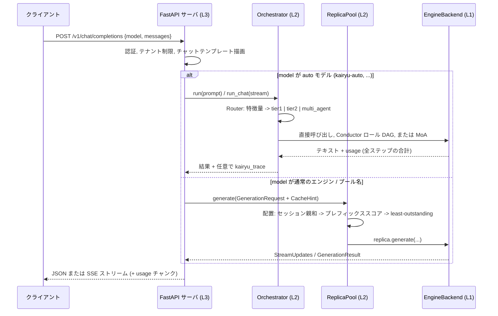
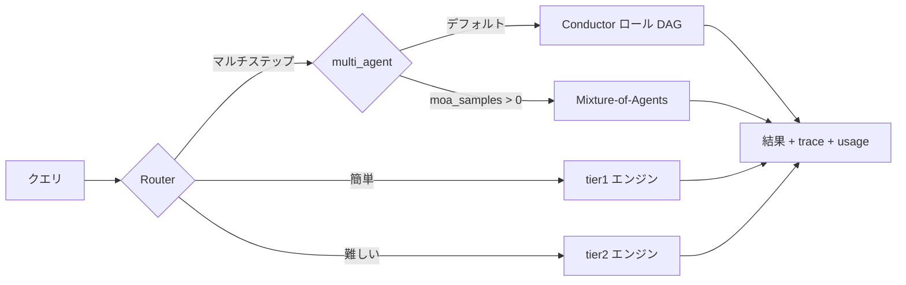

# Kairyu

[English](README.md) | **日本語**

**ネイティブなオーケストレーション機構を備えた、vLLM 互換 LLM 推論フレームワーク。**

Kairyu(海流)は、vLLM のドロップイン置き換えとなる推論 API と、ファーストクラスの
オーケストレーション層 — 学習可能な **Router**、Planner/Worker/Verifier/Synthesizer
のロール DAG を実行する **Conductor**、**Mixture-of-Agents(MoA)** — を、ひとつの
Python API とひとつの OpenAI 互換エンドポイントの背後に統合します。その下では独自の
エンジンコア(Radix-Paged KV キャッシュ、chunked-prefill スケジューラ、投機的
デコーディング、xgrammar による構造化出力、TP/EP/PP、FP8/INT8/AWQ/GPTQ/NVFP4 量子化)
が、同一のプラガブルなバックエンドシームを通して実チェックポイントを提供します。

- **Python**: 3.11+ &nbsp;|&nbsp; **ライセンス**: MIT &nbsp;|&nbsp; **テスト**: 800+(カバレッジゲート 80%、現在 ~92%)

---

## 目次

1. [Kairyu を使う理由](#1-kairyu-を使う理由)
2. [アーキテクチャ](#2-アーキテクチャ)
   - [2.1 レイヤ構成](#21-レイヤ構成)
   - [2.2 リクエストのデータフロー](#22-リクエストのデータフロー)
   - [2.3 オーケストレーションの仕組み](#23-オーケストレーションの仕組み)
   - [2.4 エンジンコアの内部構造 (L1)](#24-エンジンコアの内部構造-l1)
   - [2.5 フリート / ゲートウェイ層](#25-フリート--ゲートウェイ層)
3. [インストール](#3-インストール)
4. [クイックスタート](#4-クイックスタート)
5. [単一モデル版 — セットアップと使い方](#5-単一モデル版--セットアップと使い方)
6. [オーケストレーション版 — セットアップと使い方](#6-オーケストレーション版--セットアップと使い方)
7. [設定リファレンス](#7-設定リファレンス)
8. [ベンチマーク](#8-ベンチマーク)
9. [開発](#9-開発)
10. [ドキュメント索引](#10-ドキュメント索引)
11. [ライセンス](#11-ライセンス)

---

## 1. Kairyu を使う理由

多くのサービングスタックは、オーケストレーション(ルーティング、マルチエージェント
パイプライン、予算管理)を「生の completion エンドポイントの上にアプリ側で後付けする
もの」として扱います。Kairyu はこれをネイティブ機能にします:

- **vLLM から import 1 行の距離** — `from kairyu import LLM, SamplingParams` で既存の
  vLLM オフライン例がそのまま動作します(`tests/compat/` のコントラクトテストで検証済み)。
- **API ラインの下にあるオーケストレーション** — Router はエンジンレベルのシグナルを
  参照でき、Conductor の各ステップは温まった KV プレフィックスにヒットします
  (`cache_hint` の配管)。純粋な API レベルのフレームワークにはできないことです。
- **プラガブルなバックエンド** — すべての層は小さな非同期 `EngineBackend` プロトコル
  だけに依存するため、mock(CI)、vLLM(ローカル GPU)、OpenAI 互換(外部 API)、
  独自 `kairyu` エンジンコアをワーカーごとに差し替えられます。
- **学習するルーター** — サービングログが「蒸留 + 文脈バンディット」のパイプラインに
  流れ込み、API を変えずにルールルーターを `LearnedRouter` へアップグレードできます。

スタック全体は実装済みで、CPU 上でエンドツーエンドに検証済みです。残る作業は GPU の
パフォーマンスゲートとカーネルチューニングというハードウェア依存の部分のみで、
[`docs/gpu-runbook.md`](docs/gpu-runbook.md) と [`PROGRESS.md`](PROGRESS.md) で
管理されています。

## 2. アーキテクチャ

### 2.1 レイヤ構成

Kairyu は **L3 Interface / L2 Orchestration / L1 Engines** の 3 層構成です。L1 より上の
すべては `EngineBackend` プロトコル(`kairyu/engine/backend.py`)だけに依存するため、
独自エンジンは「もうひとつのバックエンド」であって書き直しではありません:

```
L3  Interface       kairyu.entrypoints   LLM / AsyncLLMEngine (vLLM ドロップイン),
                                         OpenAI 互換 FastAPI サーバ (SSE, tools,
                                         batch, embeddings, responses), kairyu CLI
L2  Orchestration   kairyu.orchestration Router → Conductor (ロール DAG) / MoA,
                                         Budget, JSONL 決定ログ, 学習パイプライン,
                                         ReplicaPool (セッション/プレフィックス/KV-aware ルーティング)
                    kairyu.deploy        DeploymentSpec, registry/reconciler, prober
L1  Engines         kairyu.engine        EngineBackend プロトコル + レジストリ:
                                         mock | kairyu | kairyu-proc | openai | vllm
                    kairyu.engine.core   Radix-Paged KV, chunked-prefill スケジューラ,
                                         ページドモデルランナー + サンプラー, 投機的デコーディング,
                                         アテンションバックエンド, CUDA グラフシーム,
                                         TP/EP/PP, P-D 分離, KV トランスポート
                    kairyu.models        Llama-3.x / Qwen2 / Qwen3 / Qwen3-MoE /
                                         DeepSeek-V3 (+ EAGLE-3 / MTP ドラフトヘッド)
                    kairyu.quant         FP8 / INT8 / AWQ / GPTQ / NVFP4
```

全レイヤを貫く設計テーマは「**各シームは、決定的な CPU 実装を持つ小さなプロトコル**」
です。Router・Conductor・ReplicaPool は `EngineBackend` のみに依存し、エンジン内部の
`ModelRunner`、`AttentionBackend`、`Communicator`、`KVHandoff`、`DraftSource`、
CUDA グラフの `StepExecutor` はすべて CPU フェイクでテスト固定されたプロトコルです —
GPU 実装・マルチプロセス実装は、その背後に無変更で差し替わります。

### 2.2 リクエストのデータフロー

`POST /v1/chat/completions`(`kairyu/entrypoints/server/app.py`)にリクエストが届いた
ときの流れ:



`kairyu` バックエンド(`kairyu/engine/kairyu_backend.py`)の内部では、各リクエストは
1 スレッド上でエンジン状態を専有する同期ステップループ
(`kairyu/engine/engine_loop.py`)を流れます:

```
submit -> tokenize -> Scheduler.schedule()        # chunked-prefill 計画, radix-KV アドミッション
       -> ModelRunner.execute()                   # ページド forward + Sampler (固定演算順)
       -> Scheduler.update()                      # サンプル済みトークンを radix ツリーへコミット
       -> IncrementalDetokenizer -> StreamUpdate  # SSE セーフな stop 文字列ホールドバック
```

`kairyu-proc` バックエンド(`kairyu/engine/zmq_backend.py`)は *同一の* `EngineLoop` を
ZMQ/msgpack 経由の子プロセスで駆動し、クラッシュを分離します — エンジンが落ちても
API プロセスは生き残り、エンジンを再スポーンします。

### 2.3 オーケストレーションの仕組み

予約モデル名 `kairyu-auto` の背後にある L2 パイプライン
(`kairyu/orchestration/orchestrator.py`):



**Router**(`kairyu/orchestration/router.py`, `features.py`)。ルーティングはモデルを
使わず 10 ms 以内で完了します: `extract_features` が `char_len`、`word_count`、
`has_code_fence`、`math_symbol_count`、`reasoning_keyword_count`、
`multi_step_marker_count`、`question_count` を計算します。デフォルトの `RuleRouter` は
しきい値(`RouteThresholds` で調整可能)を適用します: マルチステップマーカー 3 個以上
または 2000 文字以上 → `multi_agent`、コードフェンスあり / 推論キーワード 2 個以上 /
数式記号 3 個以上 / 600 文字以上 → `tier2`、それ以外 → `tier1`。同じ特徴量ベクトルが
そのまま学習ルーターの訓練スキーマになります。

**Conductor — ロール DAG**(`kairyu/orchestration/conductor.py`)。デフォルトの DAG は
**planner**(tier2)→ **worker**(tier1)→ **verifier**(tier2)→ **synthesizer**
(tier2)です。依存関係が満たされたロールは asyncio の「ウェーブ」で並行実行されます。
verifier は対象ロールの直後にインラインで実行され、判定が `PASS` 以外かつ予算が許す
場合、前回の出力と verifier のフィードバックから refine プロンプトを組み立てて再生成
します(`max_refine_depth` まで)。すべてのプロンプトは `shared_prefix + ロール固有部`
として `CacheHint` 付きで描画されるため、連続するステップは温まった KV プレフィックス
を保持するレプリカに着地します。失敗したユニットは trace に記録され、実行はその時点の
ベスト結果を返します — バックエンドエラー 1 つで完了済みの成果が破棄されることは
ありません。

**Mixture-of-Agents**(`kairyu/orchestration/moa.py`)。`n` 個のプロポーザが並列に
サンプリングし(temperature 0.9、シードは分散)、1 回の合成パス(temperature 0.3)が
番号付き候補をマージします。プロポーザと合成器は別バックエンドにできます(例: 安価な
tier1 プロポーザ + フロンティア級 tier2 合成器)。これが `kairyu-auto-max` ティアの
実体です。

**Budget**(`kairyu/orchestration/budget.py`)。`Budget(max_steps, max_refine_depth,
max_cost_usd)` は、プラガブルな `CostModel` を通して各ユニットが消費します。予算超過は
例外ではなく「照会可能な状態」です: Conductor は refine を止め、その時点のベスト結果を
返します。

**ルーター学習**(`kairyu/orchestration/learning/`)。`JsonlRouterLog` がルーティング
決定と結果を JSONL で記録します — クエリは SHA-256 ハッシュとして保存され、生テキスト
は決して残りません。そこから: (1) `build_dataset` が決定と結果を結合し、各クエリに
平均効用最大のターゲットをラベル付け(`utility = quality − cost_weight · cost_usd`)、
(2) 蒸留したロジスティック回帰分類器が同じ `Router` プロトコル上で `LearnedRouter` を
ウォームスタート(確信度がしきい値未満ならルールルーターへフォールバック)、
(3) `BanditRouter`(ε-greedy 文脈バンディット)がオンラインでポリシーを改善します
(各アームの観測が揃うまではベースルーターに委譲)。詳細:
[`docs/design/m4-router-learning.md`](docs/design/m4-router-learning.md)。

### 2.4 エンジンコアの内部構造 (L1)

バックエンド名 `kairyu` の背後にある独自エンジン(`kairyu/engine/core/`):

| コンポーネント | ファイル | 役割 |
|---|---|---|
| Radix-Paged KV キャッシュ | `radix_kv.py`, `pages.py`, `kv_pool.py` | ページド KV ブロック上の radix ツリーによるプレフィックス共有(参照カウント、LRU 追い出し、セッションピン)。`PagePool` はフリーリスト、`PagedKVPool` は K/V テンソルを layer-major で保持し KV トランスポートが連続スライスできる形。フリートルーティング用に vLLM 互換 KV イベントを発行。 |
| スケジューラ | `scheduler.py` | GPU を触らない純粋なポリシー: chunked-prefill のトークン予算、radix キャッシュ経由のページ粒度アドミッション、マルチトークン(投機)コミット、プリエンプション、過大プロンプトの拒否。 |
| ステップループ | `engine_core.py`, `overlap.py`, `pipeline.py` | `ModelRunner` プロトコル + `StepOutput` コントラクト。`OverlapEngineCore` はデバイスがステップ N を実行中にステップ N+1 を計画。`PipelinedEngineCore` はステップ間のパイプライン並列を追加。 |
| モデルランナー + サンプラー | `model_runner.py`, `sampler.py` | 実チェックポイント上のページド forward。サンプラーは固定演算順(logprobs → xgrammar 文法マスク → ペナルティ → temperature → min-p/top-k/top-p → シード付きサンプル)で、決定的な splitmix64 シードにより TP の全ランクが同一サンプルを得る。 |
| 投機的デコーディング | `spec_runner.py`, `draft.py` | `SpeculativeRunner` は任意の `ModelRunner` をラップ: デフォルトは n-gram プロンプト参照ドラフト、EAGLE-3 / MTP ヘッド(`kairyu/models/eagle.py`, `mtp.py`)は `ModelDraftSource` 経由。greedy 検証で「出力が通常デコードと同一」という不変条件をテストで担保。 |
| アテンションバックエンド | `attention/` | `AttentionBackend` プロトコル: `torch`(デバイス非依存のページドアテンション)、FlashInfer アダプタ(コントラクト固定)、DeepSeek 用 MLA リファレンス数学。ハードウェアプロファイルまたは `KAIRYU_ATTENTION_BACKEND` で選択。 |
| CUDA グラフシーム | `step_executor.py`, `graph_buckets.py` | バケットごとに 1 回キャプチャして静的デバイスバッファで再生。CPU 上でフェイクグラフバックエンドに対して固定済み。CUDA を触るのは `cuda_graph_gpu.py` のみ。 |
| 分散実行 | `worker.py`, `dist_comm.py`, `pp_worker.py` | TP(rank 0 がスケジューラを駆動、スナップショットブロードキャスト、ランクごとのシャード済み safetensors ロード)、EP(MoE all-to-all)、PP(ステージスライス)— デフォルトテストスイート内で gloo によるパリティゲート済み。NCCL はコンストラクタ引数。 |
| P-D 分離 + KV トランスポート | `pd.py`, `pd_remote.py`, `kv_serde.py`, `kv_transport*.py` | prefill/decode の分離をプロセス内、または実 2 プロセス間で TCP バイトパリティ付き KV 転送により実現。NIXL/RDMA アダプタ準備済み。 |
| 構造化出力 | `structured.py` | xgrammar でコンパイルした JSON スキーマ文法を、ステップごとのトークンビットマスクとして適用。 |

**モデル**(`kairyu/models/`): Llama-3.x、Qwen2、Qwen3(dense)、Qwen3-MoE、
DeepSeek-V3(MLA + sigmoid ルーティング MoE、yarn rope)— いずれもフルエンジンを
通した greedy 出力が `transformers.generate` と一致することをテストで固定。
**量子化**(`kairyu/quant/`): FP8、INT8 W8A8、AWQ、GPTQ、NVFP4 のチェックポイントを
ロード時に自動検出。5 方式すべてが CPU 上でフルエンジンを通してロード・実行でき、
GPU 用に Triton カーネルシームを備えます。

### 2.5 フリート / ゲートウェイ層

ゲートウェイノードは `ReplicaPool`(`kairyu/orchestration/replica.py`)を提供します —
これ自体が `EngineBackend` なので、エンジンを期待する場所ならどこにでも収まります。
リクエストごとの配置順序:

1. **セッション親和** — `session_id`(`X-Session-ID` ヘッダまたは OpenAI の `user`
   フィールド)を、適格な(健全 ∧ ドレイン中でない)レプリカ集合上のランデブー(HRW)
   ハッシュでレプリカに対応付け。マルチターンのセッションは温まった radix-KV
   プレフィックスを持つレプリカにヒットし続けます。
2. **負荷バルブ** — 親和先レプリカの未処理数が `queue_depth_threshold` を超えたら
   least-outstanding にフォールバック。
3. **プレフィックス / KV-aware スコアリング**(オプトイン)—
   `α · prefix_overlap − β · outstanding` でレプリカを採点。インデックスは 2 種:
   `PrefixIndex`(近似。ゲートウェイ側のチェーンハッシュされたテキストチャンク)と
   `KvEventIndex`(正確。エンジンの `BlockStored`/`BlockRemoved` イベントを ZMQ で
   受けたレプリカごとの KV ブロックハッシュ。フィードが古くなると近似トライへ
   グレースフルにフォールバック)。
4. セッションなしのトラフィックは **least outstanding**。

ヘルス管理: 連続 `unhealthy_after` 回の失敗でレプリカをリングから除外(クライアント
起因の 4xx はカウント *しない*)。バックグラウンドの `HealthProber`
(`kairyu/deploy/prober.py`)が除外レプリカの `/readyz` を叩いて復帰させます。
メンバーシップは動的(`add_replica`/`drain`/`remove_replica`)で、TTL ハートビートの
`ReplicaRegistry` + `PoolReconciler`(`kairyu/deploy/registry.py`)から駆動できます。

## 3. インストール

Python 3.11+ と [uv](https://docs.astral.sh/uv/) が必要です。Kairyu はまだ PyPI 未公開
のため、ソースからインストールします:

```bash
git clone https://github.com/ytworks/kairyu.git && cd kairyu
uv sync                       # コアのみ (軽量)
uv sync --extra engine        # + torch/xgrammar/tokenizers/safetensors (実モデル)
uv sync --group dev           # + テスト/lint ツールチェーン
```

コア依存は軽量です(pydantic、fastapi、httpx、pyyaml、uvicorn、jinja2)。重い依存は
すべてオプトインです:

| extra | 内容 | 有効になるもの |
|---|---|---|
| `--extra engine` | torch, xgrammar, tokenizers, safetensors | `kairyu` バックエンドでの実チェックポイント実行、`json_schema` 構造化出力 |
| `--extra hf` | tokenizers, safetensors | HF トークナイザ/重みのみ(torch なし) |
| `--extra fleet` | pyzmq, msgpack | `kairyu-proc` プロセス分離エンジン、KV イベントトランスポート |
| `--extra otel` | opentelemetry-sdk | トレーシングスパン(なければ no-op) |
| `--extra gpu` | flashinfer, triton, nixl | GPU カーネル/ファブリック(Linux 限定マーカー。macOS の `uv sync` はスキップ) |
| `--extra bench` | datasets, huggingface_hub, pillow, h5py | `kairyu bench download` のデータセット取得 |
| `--extra bench-agentic` | mini-swe-agent, swebench, harbor | docker ベースのエージェンティックベンチマーク |
| `--group dev` | pytest, ruff, transformers, openai, … | テストスイート + パリティゴールデン |

vLLM は Linux GPU ホストで `vllm` バックエンドを使う場合のみ必要です(同一環境に
インストールしてください)。

## 4. クイックスタート

```bash
uv run pytest                                        # フルスイート, カバレッジゲート 80%
uv run python examples/basic_offline_inference.py    # vLLM 流の LLM API (mock バックエンド)
uv run python examples/run_yaml_pool.py              # 宣言的マルチエージェントプール
uv run python examples/serve.py                      # OpenAI 互換サーバ (:8000)
```

そのまま [単一モデル版](#5-単一モデル版--セットアップと使い方) か
[オーケストレーション版](#6-オーケストレーション版--セットアップと使い方) へ進んで
ください。

## 5. 単一モデル版 — セットアップと使い方

### 5.1 Python API(vLLM ドロップイン)

`kairyu` は vLLM のオフライン API を再現しています — import を 1 行変えるだけです:

```python
from kairyu import LLM, SamplingParams   # was: from vllm import ...

llm = LLM(model="meta-llama/Llama-3.1-8B-Instruct")
outputs = llm.generate(["Hello, my name is"], SamplingParams(temperature=0.8))
print(outputs[0].outputs[0].text)
```

`SamplingParams`、`RequestOutput`、`CompletionOutput`、`AsyncEngineArgs`、
`AsyncLLMEngine` は vLLM の公開サーフェス(vLLM 自身の例で使われる範囲)を再現し、
`tests/compat/` のコントラクトテストで検証されています。非同期エンジン:

```python
from kairyu import AsyncEngineArgs, AsyncLLMEngine, SamplingParams

engine = AsyncLLMEngine.from_engine_args(AsyncEngineArgs(model="Qwen/Qwen2.5-7B-Instruct"))
async for out in engine.generate("Hello", SamplingParams(max_tokens=32), request_id="r1"):
    ...
```

### 5.2 バックエンドの選択

すべてのモデルは 5 種類の `EngineBackend` 実装(`kairyu/engine/registry.py`)の
いずれかの背後で動き、ワーカー/エンジンごとに選択できます:

| backend | 実行対象 | 使いどころ |
|---|---|---|
| `kairyu` | Kairyu 独自エンジンコア(プロセス内) | ローカルの safetensors チェックポイント。ネイティブパス(radix KV、投機的デコーディング、構造化出力) |
| `kairyu-proc` | 同じエンジンを子プロセスで(ZMQ/msgpack) | API サーバとエンジンのクラッシュ分離 |
| `vllm` | ローカル GPU 上の `vllm.AsyncLLMEngine` | すでに vLLM を運用していて、その上に Kairyu のオーケストレーションを載せたい場合 |
| `openai` | 任意の OpenAI 互換 HTTP エンドポイント | ホステッド API(Together、Fireworks、Groq、Moonshot、…)や自前の `vllm serve` / SGLang / Ollama サーバ |
| `mock` | 決定的な固定レスポンス | CI とテスト — デフォルトのテストスイート全体がこれで動く |

### 5.3 ローカルチェックポイントを動かす(`kairyu` バックエンド)

ネイティブエンジンは HF 形式の safetensors ディレクトリを直接ロードします:

```python
from kairyu import LLM, SamplingParams
from kairyu.engine.kairyu_backend import KairyuBackend

backend = KairyuBackend(model_path="/models/qwen2.5-0.5b-instruct")
llm = LLM(model="qwen", backend=backend)
print(llm.generate(["What is paged attention?"], SamplingParams(max_tokens=64)))
```

対応アーキテクチャ: **Llama-3.x、Qwen2、Qwen3、Qwen3-MoE、DeepSeek-V3**。量子化
チェックポイント(**FP8 / INT8 / AWQ / GPTQ / NVFP4**)はチェックポイントの config
から自動検出されます。主なコンストラクタオプション(DeploymentSpec の `options:` と
しても指定可能 — [バックエンドオプション表](#バックエンドオプション-enginesoptions)
参照): `tokenizer`、`num_pages`、`page_size`、`max_num_batched_tokens`、
`speculative="ngram"`、`tensor_parallel_size`。

**ローカル重みの代わりにホステッド API を使う** — `openai` バックエンドは任意の
OpenAI 互換エンドポイントを指せます。API キーは `api_key_env` で指定した環境変数から
読み込まれ、ハードコードは不要です:

```bash
export MOONSHOT_API_KEY=sk-...
```

```python
from kairyu import LLM, SamplingParams
from kairyu.engine.openai_backend import OpenAICompatBackend

backend = OpenAICompatBackend(
    base_url="https://api.moonshot.ai/v1",
    model="kimi-k2-0905-preview",           # モデル名は例示
    api_key_env="MOONSHOT_API_KEY",
)
llm = LLM(model="kimi-k2", backend=backend)
```

同じバックエンドで自前サーバ(`vllm serve`、SGLang、Ollama)にも接続できます —
`base_url="http://gpu-box:8000/v1"` を設定し、`api_key_env` には値の入った任意の
環境変数を指定します(サーバが認証を無視する場合でも変数自体は必要です)。

### 5.4 単一モデルを HTTP で提供する

`kairyu serve <config.yaml>` は **DeploymentSpec** YAML から堅牢化された OpenAI 互換
サーバを起動します。最小の単一モデル設定:

```yaml
# single_model.yaml
server:
  host: 0.0.0.0
  port: 8000

engines:
  qwen:                          # 提供するモデル名
    backend: kairyu              # または: kairyu-proc | vllm | openai | mock
    options:
      model_path: /models/qwen2.5-0.5b-instruct
```

```bash
uv run kairyu serve single_model.yaml          # --host/--port で YAML を上書き可能
curl localhost:8000/v1/chat/completions -H 'Content-Type: application/json' \
  -d '{"model": "qwen", "messages": [{"role": "user", "content": "hi"}], "stream": true}'
```

テンソル並列は YAML のエンジンごとに設定します
(`options: {tensor_parallel_size: 2}`)— serve プロセスがマルチプロセスの TP ワーカー
グループをスポーンします(CPU では gloo、GPU では NCCL)。CLI フラグはありません。

提供エンドポイント: `/v1/chat/completions`(SSE ストリーミング、tools、logprobs、
`n>1`、`response_format: json_schema`、vision コンテンツパーツ)、`/v1/completions`、
`/v1/models`、`/v1/embeddings`、`/v1/responses`(サブセット)、`/v1/files` +
`/v1/batches`、`/health`、`/readyz`、`/metrics`(Prometheus)、`/admin/*`。
全リストは[設定リファレンス](#http-サーフェス)を参照してください。

## 6. オーケストレーション版 — セットアップと使い方

### 6.1 プログラマティック

`Orchestrator` はティア名をキーにしたエンジンの dict をラップします。Router がクエリ
ごとにターゲットを選び、`multi_agent` ルートは Conductor または MoA にディスパッチ
されます:

```python
from kairyu import Orchestrator
from kairyu.engine.mock import MockBackend

orchestrator = Orchestrator(engines={"tier1": MockBackend(), "tier2": MockBackend()})
result = orchestrator.run_sync("First, plan X. Then do Y. Finally, verify.")
print(result.route.target, result.text)     # -> multi_agent, <合成された回答>
```

バックエンドは自由に混在できます — 典型的なプールは、`tier1` に小さなローカルモデル、
`tier2` にフロンティア級 API を置きます:

```python
from kairyu import Orchestrator
from kairyu.engine.openai_backend import OpenAICompatBackend
from kairyu.engine.vllm_backend import VLLMBackend

orchestrator = Orchestrator(engines={
    "tier1": VLLMBackend(model="Qwen/Qwen2.5-7B-Instruct"),
    "tier2": OpenAICompatBackend(
        base_url="https://api.moonshot.ai/v1",
        model="kimi-k2-0905-preview",
        api_key_env="MOONSHOT_API_KEY",
    ),
})
```

ルーティングしきい値は `RouteThresholds`(`kairyu/orchestration/router.py`)で調整
できます。`moa_samples=4` を渡すと、`multi_agent` ルートが Conductor ではなく
Mixture-of-Agents を通ります。

### 6.2 宣言的エージェントプール(YAML / デコレータ)

ワーカー、ロール DAG、予算を 1 ファイルで宣言します
(完全版は [`examples/agent_pool.yaml`](examples/agent_pool.yaml)):

```yaml
# pool.yaml
workers:
  - name: tier1                      # easy queries: local open model
    backend: vllm
    model: Qwen/Qwen2.5-7B-Instruct
    options:                         # extra kwargs forwarded to the backend constructor
      gpu_memory_utilization: 0.85
  - name: tier2                      # hard queries + planner/verifier roles: frontier API
    backend: openai
    model: kimi-k2-0905-preview
    base_url: https://api.moonshot.ai/v1
    api_key_env: MOONSHOT_API_KEY

roles:
  - name: planner
    worker: tier2
    role_type: planner
    prompt: "[planner] Break the task into a short plan.\nTask: {query}"
  - name: worker
    worker: tier1
    prompt: "[worker] Execute the plan.\nPlan: {planner}\nTask: {query}"
    depends_on: [planner]
  - name: synthesizer
    worker: tier2
    role_type: synthesizer
    prompt: "[synthesizer] Final answer.\nDraft: {worker}\nTask: {query}"
    depends_on: [worker]

budget:
  max_steps: 12
  max_refine_depth: 2
  max_cost_usd: 0.50                 # hard cap for one orchestrated request
  cost_per_1k_chars_usd: 0.002
```

```python
from kairyu.dsl.loader import build_orchestrator, load_spec

orchestrator = build_orchestrator(load_spec("pool.yaml"))
result = orchestrator.run_sync("Compare radix-tree and hash-based KV prefix sharing.")
print(result.route.target, result.text)
```

ロールプロンプトはテンプレートです: `{query}` はユーザークエリ、`{<ロール名>}` は
上流ロールの出力を補間し、`depends_on` が DAG のエッジを定義します。`verifies` は
そのロールを別ロールの検証者としてマークします(`PASS` 以外の判定で refine ループが
発動)。同じ仕様はデコレータのフロントエンド `kairyu.dsl.decorators.AgentPool` でも
記述できます。

### 6.3 オーケストレーションを提供する(`kairyu-auto`)

DeploymentSpec は、**通常のモデルと並べて任意個の名前付きオーケストレーション** を
提供できます — クライアントはモデル名を選ぶだけです
([`examples/deploy_multi_orchestrator.yaml`](examples/deploy_multi_orchestrator.yaml)):

```yaml
engines:
  m1: {backend: mock}                # 本番では kairyu/vllm/openai に差し替え
  m2: {backend: mock}

orchestrators:
  kairyu-auto:                       # 標準ティア: Router -> 直接 / Conductor
    spec: agent_pool.yaml
  kairyu-auto-max:                   # 深いティア: multi_agent が MoA を通る
    spec: agent_pool_max.yaml
```

```bash
uv run kairyu serve examples/deploy_multi_orchestrator.yaml
curl localhost:8000/v1/chat/completions -H 'Content-Type: application/json' \
  -d '{"model": "kairyu-auto", "messages": [{"role": "user", "content": "hi"}]}'
```

- レスポンスの usage は **全オーケストレーションステップの実合計** です — 作られた
  トークン数ではありません。
- ストリーミングは任意の OpenAI SDK で動作します: 直接ルートはトークンデルタをライブ
  配信し、マルチステージルートはステージ間に SSE コメントのキープアライブを流した後、
  最終回答を返します。
- `X-Kairyu-Trace: 1` を送ると、レスポンスに `kairyu_trace` ブロック(ルーティング
  決定、ロールごとのイベント、予算状態)が付きます。
- レガシーの単一 `orchestrator:` キーも引き続き動作し、`kairyu-auto` として提供され
  ます。

### 6.4 マルチレプリカ運用(ゲートウェイ + レプリカ)

バイナリはひとつ、ロールはふたつ — 設定ファイルが決めます。**レプリカ**ノードは
ローカルエンジンを提供し、**ゲートウェイ**ノードはリモートレプリカ群の上に
`ReplicaPool` を提供します(認証、メトリクス、ヘルスプローブ、バッチ API 付き):

```yaml
# gateway.yaml (deploy/compose/gateway.yaml を参照)
pools:
  fleet:
    replicas:
      - {backend: openai, options: {base_url: "http://replica-a:8000/v1"}}
      - {backend: openai, options: {base_url: "http://replica-b:8000/v1"}}
      - {backend: openai, options: {base_url: "http://replica-c:8000/v1"}}
    unhealthy_after: 3
    queue_depth_threshold: 8
    probe_interval_s: 5.0
```

セッション id(`X-Session-ID` ヘッダまたは OpenAI の `user` フィールド)を持つ
リクエストは、温まった radix-KV プレフィックスを保持するレプリカに固定されます。
プレフィックス / KV-aware な配置は [§2.5](#25-フリート--ゲートウェイ層) を参照。
すぐ使えるトポロジー:

```bash
./scripts/compose_smoke.sh                     # Docker compose で 1 ゲートウェイ + 3 レプリカ
docker compose -f deploy/compose/docker-compose.gpu.yaml up    # ゲートウェイ + GPU レプリカ
docker compose -f deploy/compose/docker-compose.webui.yaml up  # Open WebUI + mock モデル `default`
./scripts/webui_smoke.sh                       # WebUI 構成の Kairyu-only smoke (UI pull なし)
helm install kairyu deploy/helm/kairyu         # k8s チャート (+ values-gpu.yaml)
```

Open WebUI デモは [`deploy/compose/config.yaml`](deploy/compose/config.yaml) を
`/etc/kairyu/config.yaml` にマウントし、CPU-safe で keyless な mock モデル
`default` を 1 つ提供します。実エンジンや認証ポリシーを使う場合はこのファイルを
置き換えてください。WebUI サービスは render 後の内部 endpoint
`http://kairyu:8000/v1` からモデルを検出します。`scripts/webui_smoke.sh` は
この endpoint を検証し、Kairyu だけを起動して readiness、モデル ID の完全一致、
non-streaming completion を確認します。可変な Open WebUI image の pull や
browser test は意図的に行いません。

本番運用の詳細(DC トポロジー、systemd、ローリングモデル更新、可観測性)は
[`docs/deployment.md`](docs/deployment.md) にあります。

## 7. 設定リファレンス

デプロイで設定できるすべての項目を 1 か所に。信頼できる唯一の情報源は
`kairyu serve <config.yaml>` に渡す **DeploymentSpec YAML** です(Docker/Helm イメージ
では `/etc/kairyu/config.yaml` にマウントされます)。

### DeploymentSpec (YAML)

```yaml
server:                        # ServerSection = バインドアドレス + ServerSettings
  host: 0.0.0.0
  port: 8000
  api_keys_env: KAIRYU_KEYS    # カンマ区切りキーの入った環境変数名; null = キーなし
                               #   (キーなし = 信頼されたノード間メッシュモード)
  max_concurrency: 256         # /v1/* 全体の同時実行キャップ; null で無効
  metrics: true                # /metrics (Prometheus) を公開
  protect_metrics: false       # /metrics にも API キーを要求
  access_log: true             # リクエストごとに JSON 1 行 (X-Request-ID をエコー)
  tracing: false               # OTel スパン (otel extra が必要; なければ no-op)
  usage_ledger_path: null      # JSONL 使用量台帳; GET /admin/usage を有効化

tenants:                       # 任意: 認証済み API キー -> テナントの対応
  default_tenant: default      # 下にない解決済みキーはこのテナントを使用
  key_tenants:                 # 各キーはカンマ区切りの $KAIRYU_KEYS に含める
    key-a: team-a
    key-b: team-b
  limits:                      # 任意: 既知テナントごとの独立したバケット
    team-a: {requests_per_minute: 60, tokens_per_minute: 10000}
    team-b: {requests_per_minute: 120, tokens_per_minute: 20000}

engines:                       # 提供モデル名 -> バックエンド 1 つ
  qwen:
    backend: kairyu            # mock | kairyu | kairyu-proc | openai | vllm
    options:                   # ファクトリ kwargs (下のバックエンドオプション参照)
      model_path: /models/qwen2.5-0.5b
  remote-a:
    backend: openai
    options: {base_url: "http://replica-a:8000/v1"}
    health_url: null           # デフォルト: <base_url から /v1 を除いた>/health

pools:                         # 提供モデル名 -> N レプリカの ReplicaPool
  fleet:
    replicas:
      - {backend: openai, options: {base_url: "http://replica-a:8000/v1"}}
      - {backend: openai, options: {base_url: "http://replica-b:8000/v1"}}
    unhealthy_after: 3         # リングから外れるまでの連続失敗回数
    queue_depth_threshold: 8   # セッション親和の負荷バルブ
    probe_interval_s: 5.0      # バックグラウンドヘルスプローバー

chat_templates:                # 提供モデル -> HF Jinja テンプレート (テキストか *.jinja パス)
  qwen: templates/qwen.jinja

orchestrator:                  # 任意の kairyu-auto (OrchestratorSpec YAML)
  spec: orchestrator.yaml

orchestrators:                 # 任意の名前付き auto モデル (任意個; それぞれ
  kairyu-auto-max:             #   任意のワーカー/ロール DAG 構成)
    spec: agent_pool_max.yaml

batch:                         # 任意の OpenAI 互換 /v1/files + /v1/batches
  data_dir: /var/kairyu/batches
  max_concurrency: 4
```

### バックエンドオプション (`engines.*.options`)

| backend | オプション | デフォルト | 意味 |
|---|---|---|---|
| `kairyu` | `model_path` | — | safetensors チェックポイントディレクトリ(Llama-3.x / Qwen2 / Qwen3 / Qwen3-MoE / DeepSeek-V3。FP8/INT8/AWQ/GPTQ/NVFP4 量子化チェックポイントは自動検出) |
| | `tokenizer` | モデルディレクトリ | HF トークナイザディレクトリの上書き(`tokenizer.json`) |
| | `num_pages` | 4096 | KV プールのページ数 |
| | `page_size` | 16 | KV ページあたりのトークン数 |
| | `max_num_batched_tokens` | 2048 | ステップあたりの chunked-prefill 予算 |
| | `speculative` | null | `"ngram"` で投機的デコーディングを有効化 |
| | `speculative_tokens` | 4 | ドラフト長 k |
| | `tensor_parallel_size` | 1 | TP 度数。>1 で serve プロセスからマルチプロセス TP ワーカーグループをスポーン(CPU は gloo、GPU は NCCL) |
| `kairyu-proc` | `kairyu` と同じ | — | エンジンを別プロセスで実行(ZMQ/msgpack、クラッシュ分離) |
| `openai` | `base_url`, `api_key`, `model` | — | 任意の OpenAI 互換エンドポイント |
| `vllm` | vLLM エンジン kwargs | — | vllm がインストールされた Linux GPU ホストが必要 |
| `mock` | — | — | 決定的な CI バックエンド |

### 環境変数

| 変数 | 効果 |
|---|---|
| `KAIRYU_ATTENTION_BACKEND` | `torch` \| `flashinfer` — ハードウェアプロファイルによるカーネル選択を上書き(無効な値は即座にエラー) |
| `server.api_keys_env` で指定した変数 | カンマ区切りの API キー |
| `KAIRYU_BENCH_CACHE` | ベンチマークデータセットのキャッシュディレクトリ(デフォルト `~/.cache/kairyu/benchmarks`) |
| `KAIRYU_MODEL_DIR` | `docker-compose.gpu.yaml` のモデルボリューム |
| `GLOO_SOCKET_IFNAME` | macOS で gloo ランデブーが失敗する場合に `lo0` を設定(dist テスト) |

### HTTP サーフェス

`/v1/chat/completions`(SSE、tools、logprobs、n>1、`response_format: json_schema`、
vision コンテンツパーツのワイヤ形式)、`/v1/completions`、`/v1/embeddings`
(float + base64)、`/v1/responses`(サブセット: `input`、`instructions`、
`previous_response_id`)、`/v1/models`、`/v1/files` + `/v1/batches`、`/health`、
`/readyz`、`/metrics`、`POST /admin/drain` / `POST /admin/undrain`(認証保護。drain は
readyz を 503 に切り替え)、`GET /admin/usage?tenant=`(台帳有効時)。

リクエスト拡張: `X-Session-ID`(または OpenAI の `user` フィールド)はセッションを
温まった KV プレフィックスを持つレプリカに固定します。`X-Kairyu-Trace: 1` は
`kairyu-auto` レスポンスに `kairyu_trace` ブロックを追加します。
`stream_options: {include_usage: true}` は最後に usage チャンクを付加します。

### マルチテナンシー

`kairyu serve` では、上の DeploymentSpec にある任意の `tenants:` ブロックが主要な設定
経路です。この例では `KAIRYU_KEYS` のカンマ区切り値に `key-a,key-b` を含める必要が
あります。`key_tenants` の各キーは解決済みの data-plane API キー集合のメンバーで
なければならず、対応表にない解決済みキーは `default_tenant` を使用します。未知の
キーや未知のテナントに対する limits は、所有バックエンドを構築する前の deployment
preflight で拒否されます。対応表のキーは環境変数名ではなく実際の API キー値なので、
deployment file は secret を含む設定として保護してください。

各テナントには、1 分あたりのリクエスト数とトークン数について独立したバケットが
作られます。明示的な profile がないテナントにはデフォルト値(600 requests/min、
200,000 tokens/min)が適用されます。認証はテナント制限より先に実行されるため、拒否
された認証情報はバケットを消費しません。`server.usage_ledger_path` を設定すると、成功
したリクエストの使用量は JSONL 台帳と `/admin/usage` の集計で、対応するテナント名の
下にグループ化されます。

プログラマティックな呼び出しでは、従来どおり runtime 設定を直接渡せます:
`create_app(..., tenant_config=TenantConfig(key_tenants={"key-a": "team-a"},
limits={"team-a": TenantLimits(requests_per_minute=600,
tokens_per_minute=200_000)}))`。

### デプロイ成果物

| 成果物 | 用途 |
|---|---|
| `Dockerfile` / `Dockerfile.cuda` | CPU / CUDA イメージ(ロールごとに 1 イメージ。マウントされた spec が役割を決定) |
| `deploy/compose/docker-compose.yaml` | ゲートウェイ + CPU レプリカ 3 台のスモークトポロジー |
| `deploy/compose/docker-compose.gpu.yaml` | ゲートウェイ + GPU レプリカ(nvidia デバイス予約) |
| `deploy/compose/docker-compose.webui.yaml` | ゲートウェイ上の Open WebUI チャット UI |
| `deploy/helm/kairyu/`(+ `values-gpu.yaml`) | k8s チャート。readiness は `/readyz`、GPU プロファイルごとの nodeSelector |
| `scripts/kind_smoke.sh` | kind クラスタのエンドツーエンドスモーク(CI ジョブ) |
| `scripts/webui_smoke.sh` | Open WebUI 構成の Kairyu-only smoke。UI image は pull しない |
| `scripts/gpu_gates/*.sh` | GPU デイのゲートスクリプト(runbook §0–§9)。すべて `--dry-run` 対応 |
| `bench/serving_bench.py`, `bench/frontier_compare.py`, `bench/kv_transfer_bench.py` | レイテンシ/グッドプット/転送ベンチ |

## 8. ベンチマーク

`kairyu bench` は、デプロイ済みゲートウェイに対して Fugu リリースの 11 ベンチマーク
品質スイートを実行します — 単一モデルとオーケストレーションティアがスコアボードの
列として並び、日付・脚注付きのスコアボードが出力されます:

```bash
uv run kairyu serve examples/deploy_multi_orchestrator.yaml &
uv run kairyu bench run --base-url http://localhost:8000/v1 \
    --model m1 --model kairyu-auto --model kairyu-auto-max
```

データセットは `~/.cache/kairyu/benchmarks` にダウンロードされます(コミットされま
せん)。前提条件が満たせない場合(docker なし、ゲート付きデータセット、ジャッジなし)
は注釈付きの `skipped` セルになるため、実行は常に完走します。サブコマンド:
`bench run`、`bench download`、`bench report <run>`、`bench list`。
詳細ガイド: [`docs/benchmarks.md`](docs/benchmarks.md)。

## 9. 開発

```bash
uv run pytest                        # テスト + カバレッジ (ゲート 80%, addopts で強制)
uv run ruff check .                  # lint (E, F, I, UP, B; 行長 100)
uv run python bench/router_latency.py
uv run python bench/orchestration_mock_bench.py
```

| pytest の実行方法 | 範囲 |
|---|---|
| `pytest`(デフォルト) | `gpu` と `hf_hub` マーカー以外すべて — GPU なしのどのマシンでも実行可能 |
| `pytest -m gpu` | デプロイデイのカーネル/グラフテスト(`tests/gpu/`) |
| `pytest -m hf_hub` | オプトインの実チェックポイントダウンロード |
| `pytest -m dist` | マルチプロセス gloo テスト(デフォルト実行に含まれる) |

規約: CI 向けテストはすべて `MockBackend`(決定的、依存なし)で実行します。GPU 依存の
主張は `bench/` の再現スクリプトなしには決して報告しません。

## 10. ドキュメント索引

| ドキュメント | 内容 |
|---|---|
| [`PROGRESS.md`](PROGRESS.md) | セッション横断の変更ログ: 設計決定、マイルストーン状況、ブロッカー |
| [`docs/design/`](docs/design/) | マイルストーンごとのレビュー済み設計ドキュメント(m1–m19、GPU デイシーム) |
| [`docs/goals/`](docs/goals/) | エビデンスファーストのゴール契約(マルチ GPU、MoE エンジン、フリートスケール、プロダクトサーフェス) |
| [`docs/deployment.md`](docs/deployment.md) | 本番デプロイ: DC トポロジー、systemd、ローリング更新、可観測性 |
| [`docs/gpu-runbook.md`](docs/gpu-runbook.md) | GPU デイ実行計画の集約(パフォーマンスゲート、カーネルチューニング、ファブリック立ち上げ) |
| [`docs/benchmarks.md`](docs/benchmarks.md) | Fugu ベンチマークスイートのガイド |

## 11. ライセンス

MIT — [LICENSE](LICENSE) を参照してください。
