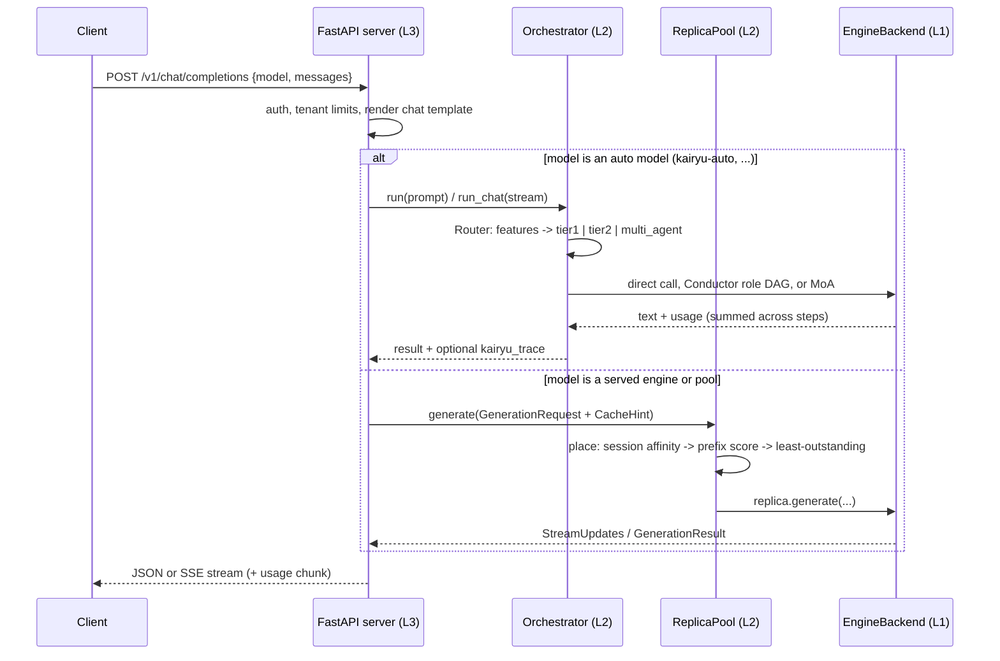
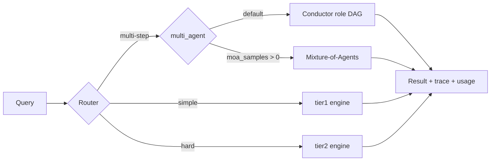

# Kairyu

**English** | [日本語](README.ja.md)

**vLLM-compatible LLM inference framework with native orchestration.**

Kairyu (海流, "ocean current") combines a vLLM drop-in inference API with a first-class
orchestration layer — a learned-router-ready **Router**, a Planner/Worker/Verifier/Synthesizer
**Conductor** (role DAG), and **Mixture-of-Agents** — all behind one Python API and one
OpenAI-compatible endpoint. Underneath, a custom engine core (Radix-Paged KV cache,
chunked-prefill scheduler, speculative decoding, xgrammar structured output, TP/EP/PP,
FP8/INT8/AWQ/GPTQ/NVFP4 quantization) serves real checkpoints through the same pluggable
backend seam.

- **Python**: 3.11+ &nbsp;|&nbsp; **License**: MIT &nbsp;|&nbsp; **Tests**: 800+ (coverage gate 80%, currently ~92%)

---

## Table of contents

1. [Why Kairyu](#1-why-kairyu)
2. [Architecture](#2-architecture)
   - [2.1 Layered architecture](#21-layered-architecture)
   - [2.2 Request data flow](#22-request-data-flow)
   - [2.3 How orchestration works](#23-how-orchestration-works)
   - [2.4 Engine core internals (L1)](#24-engine-core-internals-l1)
   - [2.5 Fleet / gateway layer](#25-fleet--gateway-layer)
3. [Installation](#3-installation)
4. [Quick start](#4-quick-start)
5. [Single-model setup & usage](#5-single-model-setup--usage)
6. [Orchestration setup & usage](#6-orchestration-setup--usage)
7. [Configuration reference](#7-configuration-reference)
8. [Benchmarks](#8-benchmarks)
9. [Development](#9-development)
10. [Documentation index](#10-documentation-index)
11. [License](#11-license)

---

## 1. Why Kairyu

Most serving stacks treat orchestration (routing, multi-agent pipelines, budgets) as an
application-side afterthought bolted onto a raw completion endpoint. Kairyu makes it native:

- **One import away from vLLM** — `from kairyu import LLM, SamplingParams` runs existing
  vLLM offline examples unchanged, verified by contract tests (`tests/compat/`).
- **Orchestration below the API line** — the Router sees engine-level signals, and the
  Conductor's steps hit warm KV prefixes (`cache_hint` plumbing), which pure API-level
  frameworks cannot do.
- **Pluggable backends** — every layer talks to a small async `EngineBackend` protocol, so
  mock (CI), vLLM (local GPU), OpenAI-compatible (external APIs), and the custom `kairyu`
  engine core are interchangeable per worker.
- **Routers that learn** — serving logs feed a distillation + contextual-bandit pipeline
  that upgrades the rule router into a `LearnedRouter` without an API change.

The whole stack is implemented and CPU-verified end to end; GPU performance gates and kernel
tuning are the remaining hardware-bound work, tracked in
[`docs/gpu-runbook.md`](docs/gpu-runbook.md) and [`PROGRESS.md`](PROGRESS.md).

## 2. Architecture

### 2.1 Layered architecture

Kairyu is layered as **L3 Interface / L2 Orchestration / L1 Engines**. Everything above L1
depends only on the `EngineBackend` protocol (`kairyu/engine/backend.py`), so the custom
engine is "one more backend", not a rewrite:

```
L3  Interface       kairyu.entrypoints   LLM / AsyncLLMEngine (vLLM drop-in),
                                         OpenAI-compatible FastAPI server (SSE, tools,
                                         batch, embeddings, responses), kairyu CLI
L2  Orchestration   kairyu.orchestration Router → Conductor (role DAG) / MoA,
                                         Budget, JSONL decision logs, learning pipeline,
                                         ReplicaPool (session/prefix/KV-aware routing)
                    kairyu.deploy        DeploymentSpec, registry/reconciler, prober
L1  Engines         kairyu.engine        EngineBackend protocol + registry:
                                         mock | kairyu | kairyu-proc | openai | vllm
                    kairyu.engine.core   Radix-Paged KV, chunked-prefill scheduler,
                                         paged model runner + sampler, spec decode,
                                         attention backends, CUDA-graph seam,
                                         TP/EP/PP, P-D separation, KV transport
                    kairyu.models        Llama-3.x / Qwen2 / Qwen3 / Qwen3-MoE /
                                         DeepSeek-V3 (+ EAGLE-3 / MTP draft heads)
                    kairyu.quant         FP8 / INT8 / AWQ / GPTQ / NVFP4
```

A design theme runs through every layer: **each seam is a small protocol with a
deterministic CPU implementation**. The Router, Conductor, and ReplicaPool depend only on
`EngineBackend`; inside the engine, `ModelRunner`, `AttentionBackend`, `Communicator`,
`KVHandoff`, `DraftSource`, and the CUDA-graph `StepExecutor` are all protocols with CPU
fakes pinned by tests — GPU and multi-process implementations swap in behind them unchanged.

### 2.2 Request data flow

What happens when a request hits `POST /v1/chat/completions`
(`kairyu/entrypoints/server/app.py`):



Inside the `kairyu` backend (`kairyu/engine/kairyu_backend.py`), each request flows through
a synchronous step loop that owns all engine state on one thread
(`kairyu/engine/engine_loop.py`):

```
submit -> tokenize -> Scheduler.schedule()        # chunked-prefill plan, radix-KV admission
       -> ModelRunner.execute()                   # paged forward + Sampler (fixed op order)
       -> Scheduler.update()                      # commit sampled tokens to the radix tree
       -> IncrementalDetokenizer -> StreamUpdate  # SSE-safe stop-string holdback
```

The `kairyu-proc` backend (`kairyu/engine/zmq_backend.py`) drives the *same* `EngineLoop`
in a child process over ZMQ/msgpack for crash isolation — the API process survives an
engine crash and respawns it.

### 2.3 How orchestration works

The L2 pipeline behind the reserved model name `kairyu-auto`
(`kairyu/orchestration/orchestrator.py`):



**Router** (`kairyu/orchestration/router.py`, `features.py`). Routing is model-free and
runs in well under 10 ms: `extract_features` computes `char_len`, `word_count`,
`has_code_fence`, `math_symbol_count`, `reasoning_keyword_count`,
`multi_step_marker_count`, and `question_count`. The default `RuleRouter` applies
thresholds (tunable via `RouteThresholds`): ≥3 multi-step markers or ≥2000 chars →
`multi_agent`; a code fence, ≥2 reasoning keywords, ≥3 math symbols, or ≥600 chars →
`tier2`; everything else → `tier1`. The same feature vector doubles as the training schema
for the learned router.

**Conductor — role DAG** (`kairyu/orchestration/conductor.py`). The default DAG is
**planner** (tier2) → **worker** (tier1) → **verifier** (tier2) → **synthesizer** (tier2).
Roles whose dependencies are satisfied run concurrently in asyncio "waves". A verifier runs
inline after its target: if the verdict is not `PASS` and the budget allows, the Conductor
builds a refine prompt from the previous attempt plus the verifier's feedback and
regenerates (up to `max_refine_depth`). All prompts render as `shared_prefix + role_suffix`
with a `CacheHint`, so successive steps land on the replica holding the warm KV prefix. A
failing unit is recorded in the trace and the run returns best-so-far — one backend error
never discards completed work.

**Mixture-of-Agents** (`kairyu/orchestration/moa.py`). `n` proposers sample in parallel
(temperature 0.9, distinct seeds), then one synthesis pass (temperature 0.3) merges the
numbered candidates. Proposers and the synthesizer can be different backends (e.g. cheap
tier1 proposers, frontier tier2 synthesizer). This is the mechanism behind the
`kairyu-auto-max` tier.

**Budget** (`kairyu/orchestration/budget.py`). `Budget(max_steps, max_refine_depth,
max_cost_usd)` is charged by every unit through a pluggable `CostModel`. Exhaustion is
queryable, not raised: the Conductor stops refining and returns the best result so far.

**Router learning** (`kairyu/orchestration/learning/`). `JsonlRouterLog` records routing
decisions and outcomes as JSONL — queries are stored as SHA-256 hashes, never raw text.
From there: (1) `build_dataset` joins decisions with outcomes and labels each query with
the highest mean-utility target (`utility = quality − cost_weight · cost_usd`);
(2) a distilled logistic-regression classifier warm-starts `LearnedRouter` on the same
`Router` protocol, falling back to the rule router below a confidence threshold;
(3) `BanditRouter` (epsilon-greedy contextual bandit) refines the policy online, deferring
to its base router until every arm has enough observations. See
[`docs/design/m4-router-learning.md`](docs/design/m4-router-learning.md).

### 2.4 Engine core internals (L1)

The custom engine behind backend name `kairyu` (`kairyu/engine/core/`):

| Component | Files | What it does |
|---|---|---|
| Radix-Paged KV cache | `radix_kv.py`, `pages.py`, `kv_pool.py` | Radix-tree prefix sharing over paged KV blocks (refcounted, LRU eviction, session pins); `PagePool` free list; `PagedKVPool` holds K/V tensors layer-major so KV transport slices contiguously. Emits vLLM-compatible KV events for fleet routing. |
| Scheduler | `scheduler.py` | Pure policy, no GPU: chunked-prefill token budgets, page-granularity admission through the radix cache, multi-token (speculative) commit, preemption, oversized-prompt rejection. |
| Step loop | `engine_core.py`, `overlap.py`, `pipeline.py` | `ModelRunner` protocol + `StepOutput` contract; `OverlapEngineCore` plans step N+1 while the device runs step N; `PipelinedEngineCore` adds inter-step pipeline parallelism. |
| Model runner + sampler | `model_runner.py`, `sampler.py` | Paged forward over real checkpoints; sampler with a fixed op order (logprobs → xgrammar grammar mask → penalties → temperature → min-p/top-k/top-p → seeded sample) and deterministic splitmix64 seeding so TP ranks sample identically. |
| Speculative decoding | `spec_runner.py`, `draft.py` | `SpeculativeRunner` wraps any `ModelRunner`: n-gram prompt-lookup drafts by default, `ModelDraftSource` for EAGLE-3 / MTP heads (`kairyu/models/eagle.py`, `mtp.py`); greedy verification with a tested output-identical invariant. |
| Attention backends | `attention/` | `AttentionBackend` protocol: `torch` (device-agnostic paged attention), FlashInfer adapter (contract-pinned), MLA reference math for DeepSeek; selected from the hardware profile or `KAIRYU_ATTENTION_BACKEND`. |
| CUDA-graph seam | `step_executor.py`, `graph_buckets.py` | Capture-once-per-bucket replay with static device buffers, pinned on CPU against a fake graph backend; only `cuda_graph_gpu.py` touches CUDA. |
| Distributed | `worker.py`, `dist_comm.py`, `pp_worker.py` | TP (rank 0 drives the scheduler, snapshot broadcast, per-rank sharded safetensors loading), EP (MoE all-to-all), PP (stage slices) — parity-gated with gloo in the default test suite; NCCL is a constructor argument. |
| P-D separation + KV transport | `pd.py`, `pd_remote.py`, `kv_serde.py`, `kv_transport*.py` | Prefill/decode disaggregation in-process or across two real processes with byte-parity KV transfer over TCP; NIXL/RDMA adapter ready. |
| Structured output | `structured.py` | xgrammar-compiled JSON-schema grammars applied as per-step token bitmasks. |

**Models** (`kairyu/models/`): Llama-3.x, Qwen2, Qwen3 (dense), Qwen3-MoE, DeepSeek-V3
(MLA + sigmoid-routed MoE, yarn rope) — all pinned to `transformers.generate` greedy parity
through the full engine. **Quantization** (`kairyu/quant/`): FP8, INT8 W8A8, AWQ, GPTQ,
NVFP4 checkpoints auto-detected at load; all five load and run through the full engine on
CPU, with Triton kernel seams for GPU.

### 2.5 Fleet / gateway layer

A gateway node serves a `ReplicaPool` (`kairyu/orchestration/replica.py`) — itself an
`EngineBackend`, so it slots in anywhere an engine is expected. Placement order per request:

1. **Session affinity** — `session_id` (from `X-Session-ID` or the OpenAI `user` field)
   maps to a replica by rendezvous (HRW) hashing over eligible (healthy ∧ not draining)
   replicas, so multi-turn sessions keep hitting their warm radix-KV prefix.
2. **Load valve** — if the affine replica's outstanding depth exceeds
   `queue_depth_threshold`, fall back to least-outstanding.
3. **Prefix/KV-aware scoring** (opt-in) — score replicas by
   `α · prefix_overlap − β · outstanding`, using two indexes: `PrefixIndex`
   (approximate, gateway-side chained-hash text chunks) and `KvEventIndex` (precise
   per-replica KV block hashes fed by engine `BlockStored`/`BlockRemoved` events over ZMQ;
   a stale feed gracefully falls back to the approximate trie).
4. **Least outstanding** for session-less traffic.

Health: `unhealthy_after` consecutive failures ejects a replica (client 4xx errors are
*not* counted); a background `HealthProber` (`kairyu/deploy/prober.py`) probes ejected
replicas' `/readyz` and restores them. Membership is dynamic
(`add_replica`/`drain`/`remove_replica`) and can be driven by a TTL-heartbeat
`ReplicaRegistry` + `PoolReconciler` (`kairyu/deploy/registry.py`).

## 3. Installation

Requires Python 3.11+ and [uv](https://docs.astral.sh/uv/). Kairyu is not on PyPI yet —
install from source:

```bash
git clone https://github.com/ytworks/kairyu.git && cd kairyu
uv sync                       # core only (lightweight)
uv sync --extra engine        # + torch/xgrammar/tokenizers/safetensors (real models)
uv sync --group dev           # + test/lint toolchain
```

Core dependencies are lightweight (pydantic, fastapi, httpx, pyyaml, uvicorn, jinja2).
Everything heavier is opt-in:

| extra | contents | enables |
|---|---|---|
| `--extra engine` | torch, xgrammar, tokenizers, safetensors | real checkpoints through the `kairyu` backend, `json_schema` structured output |
| `--extra hf` | tokenizers, safetensors | HF tokenizer/weights only (no torch) |
| `--extra fleet` | pyzmq, msgpack | `kairyu-proc` process-split engine, KV event transport |
| `--extra otel` | opentelemetry-sdk | tracing spans (no-op without it) |
| `--extra gpu` | flashinfer, triton, nixl | GPU kernels/fabric (Linux-only markers; macOS `uv sync` skips them) |
| `--extra bench` | datasets, huggingface_hub, pillow, h5py | `kairyu bench download` dataset fetching |
| `--extra bench-agentic` | mini-swe-agent, swebench, harbor | docker-based agentic benchmarks |
| `--group dev` | pytest, ruff, transformers, openai, … | test suite + parity goldens |

vLLM is only needed for the `vllm` backend on a Linux GPU host (install it in the same
environment).

## 4. Quick start

```bash
uv run pytest                                        # full suite, coverage gate 80%
uv run python examples/basic_offline_inference.py    # vLLM-style LLM API (mock backend)
uv run python examples/run_yaml_pool.py              # declarative multi-agent pool
uv run python examples/serve.py                      # OpenAI-compatible server on :8000
```

Then pick your path: [single model](#5-single-model-setup--usage) or
[orchestration](#6-orchestration-setup--usage).

## 5. Single-model setup & usage

### 5.1 Python API (vLLM drop-in)

`kairyu` replicates the vLLM offline surface — change one import:

```python
from kairyu import LLM, SamplingParams   # was: from vllm import ...

llm = LLM(model="meta-llama/Llama-3.1-8B-Instruct")
outputs = llm.generate(["Hello, my name is"], SamplingParams(temperature=0.8))
print(outputs[0].outputs[0].text)
```

`SamplingParams`, `RequestOutput`, `CompletionOutput`, `AsyncEngineArgs`, and
`AsyncLLMEngine` replicate vLLM's public surface (the subset exercised by vLLM's own
examples), verified by the contract tests in `tests/compat/`. The async engine:

```python
from kairyu import AsyncEngineArgs, AsyncLLMEngine, SamplingParams

engine = AsyncLLMEngine.from_engine_args(AsyncEngineArgs(model="Qwen/Qwen2.5-7B-Instruct"))
async for out in engine.generate("Hello", SamplingParams(max_tokens=32), request_id="r1"):
    ...
```

### 5.2 Choosing a backend

Every model runs behind one of five `EngineBackend` implementations
(`kairyu/engine/registry.py`), chosen per worker/engine:

| backend | runs | when to use |
|---|---|---|
| `kairyu` | Kairyu's own engine core, in-process | local safetensors checkpoints; the native path (radix KV, spec decode, structured output) |
| `kairyu-proc` | same engine in a child process (ZMQ/msgpack) | crash isolation between the API server and the engine |
| `vllm` | `vllm.AsyncLLMEngine` on a local GPU | you already run vLLM and want Kairyu's orchestration on top |
| `openai` | any OpenAI-compatible HTTP endpoint | hosted APIs (Together, Fireworks, Groq, Moonshot, …) or your own `vllm serve` / SGLang / Ollama box |
| `mock` | deterministic canned responses | CI and tests — the entire default test suite runs on it |

### 5.3 Running a local checkpoint (`kairyu` backend)

The native engine loads HF-format safetensors directories directly:

```python
from kairyu import LLM, SamplingParams
from kairyu.engine.kairyu_backend import KairyuBackend

backend = KairyuBackend(model_path="/models/qwen2.5-0.5b-instruct")
llm = LLM(model="qwen", backend=backend)
print(llm.generate(["What is paged attention?"], SamplingParams(max_tokens=64)))
```

Supported architectures: **Llama-3.x, Qwen2, Qwen3, Qwen3-MoE, DeepSeek-V3**. Quantized
checkpoints (**FP8 / INT8 / AWQ / GPTQ / NVFP4**) are auto-detected from the checkpoint
config. Key constructor options (also available as `options:` in a DeploymentSpec — see
the [backend options table](#backend-options-enginesoptions)): `tokenizer`, `num_pages`,
`page_size`, `max_num_batched_tokens`, `speculative="ngram"`, `tensor_parallel_size`.

**Hosted API instead of local weights** — the `openai` backend points at any
OpenAI-compatible endpoint; the API key is read from the environment variable named by
`api_key_env`, never hardcoded:

```bash
export MOONSHOT_API_KEY=sk-...
```

```python
from kairyu import LLM, SamplingParams
from kairyu.engine.openai_backend import OpenAICompatBackend

backend = OpenAICompatBackend(
    base_url="https://api.moonshot.ai/v1",
    model="kimi-k2-0905-preview",           # model names are illustrative
    api_key_env="MOONSHOT_API_KEY",
)
llm = LLM(model="kimi-k2", backend=backend)
```

The same backend reaches a server you run yourself (`vllm serve`, SGLang, Ollama) — set
`base_url="http://gpu-box:8000/v1"` and point `api_key_env` at any set variable
(the variable must exist even if the server ignores auth).

### 5.4 Serving a single model over HTTP

`kairyu serve <config.yaml>` starts the hardened OpenAI-compatible server from a
**DeploymentSpec** YAML. Minimal single-model config:

```yaml
# single_model.yaml
server:
  host: 0.0.0.0
  port: 8000

engines:
  qwen:                          # served model name
    backend: kairyu              # or: kairyu-proc | vllm | openai | mock
    options:
      model_path: /models/qwen2.5-0.5b-instruct
```

```bash
uv run kairyu serve single_model.yaml          # --host/--port override the YAML
curl localhost:8000/v1/chat/completions -H 'Content-Type: application/json' \
  -d '{"model": "qwen", "messages": [{"role": "user", "content": "hi"}], "stream": true}'
```

Tensor parallelism is configured per engine in the YAML
(`options: {tensor_parallel_size: 2}`) — the serve process spawns a multi-process TP
worker group (gloo on CPU, NCCL on GPU). There is no CLI flag for it.

Endpoints served: `/v1/chat/completions` (SSE streaming, tools, logprobs, `n>1`,
`response_format: json_schema`, vision content parts), `/v1/completions`, `/v1/models`,
`/v1/route` (non-dispatching route preview), `/routing` (routing descriptor),
`/v1/embeddings`, `/v1/responses` (subset), `/v1/files` + `/v1/batches`, `/health`,
`/readyz`, `/metrics` (Prometheus), `/admin/*`. Full list in the
[configuration reference](#http-surface).

## 6. Orchestration setup & usage

### 6.1 Programmatic

An `Orchestrator` wraps a dict of engines keyed by tier name. The Router picks a target
per query; `multi_agent` routes dispatch to the Conductor or MoA:

```python
from kairyu import Orchestrator
from kairyu.engine.mock import MockBackend

orchestrator = Orchestrator(engines={"tier1": MockBackend(), "tier2": MockBackend()})
result = orchestrator.run_sync("First, plan X. Then do Y. Finally, verify.")
print(result.route.target, result.text)     # -> multi_agent, <synthesized answer>
```

Mix real backends freely — a typical pool puts a small local model on `tier1` and a
frontier API on `tier2`:

```python
from kairyu import Orchestrator
from kairyu.engine.openai_backend import OpenAICompatBackend
from kairyu.engine.vllm_backend import VLLMBackend

orchestrator = Orchestrator(engines={
    "tier1": VLLMBackend(model="Qwen/Qwen2.5-7B-Instruct"),
    "tier2": OpenAICompatBackend(
        base_url="https://api.moonshot.ai/v1",
        model="kimi-k2-0905-preview",
        api_key_env="MOONSHOT_API_KEY",
    ),
})
```

Routing thresholds are tunable via `RouteThresholds`
(`kairyu/orchestration/router.py`); pass `moa_samples=4` to route `multi_agent` through
Mixture-of-Agents instead of the Conductor.

### 6.2 Declarative agent pools (YAML / decorators)

Workers, a role DAG, and a budget in one file
([`examples/agent_pool.yaml`](examples/agent_pool.yaml) is the complete version):

```yaml
# pool.yaml
workers:
  - name: tier1                      # easy queries: local open model
    backend: vllm
    model: Qwen/Qwen2.5-7B-Instruct
    options:                         # extra kwargs forwarded to the backend constructor
      gpu_memory_utilization: 0.85
  - name: tier2                      # hard queries + planner/verifier roles: frontier API
    backend: openai
    model: kimi-k2-0905-preview
    base_url: https://api.moonshot.ai/v1
    api_key_env: MOONSHOT_API_KEY

roles:
  - name: planner
    worker: tier2
    role_type: planner
    prompt: "[planner] Break the task into a short plan.\nTask: {query}"
  - name: worker
    worker: tier1
    prompt: "[worker] Execute the plan.\nPlan: {planner}\nTask: {query}"
    depends_on: [planner]
  - name: synthesizer
    worker: tier2
    role_type: synthesizer
    prompt: "[synthesizer] Final answer.\nDraft: {worker}\nTask: {query}"
    depends_on: [worker]

budget:
  max_steps: 12
  max_refine_depth: 2
  max_cost_usd: 0.50                 # hard cap for one orchestrated request
  cost_per_1k_chars_usd: 0.002
```

```python
from kairyu.dsl.loader import build_orchestrator, load_spec

orchestrator = build_orchestrator(load_spec("pool.yaml"))
result = orchestrator.run_sync("Compare radix-tree and hash-based KV prefix sharing.")
print(result.route.target, result.text)
```

Role prompts are templates: `{query}` is the user query, `{<role_name>}` interpolates an
upstream role's output, `depends_on` defines the DAG edges, and `verifies` marks a role as
the verifier of another (triggering the refine loop on a non-`PASS` verdict). The same
spec is available as a decorator front-end via `kairyu.dsl.decorators.AgentPool`.

### 6.3 Serving orchestration (`kairyu-auto`)

A DeploymentSpec can serve any number of **named orchestrations alongside plain models** —
clients just pick a model name
([`examples/deploy_multi_orchestrator.yaml`](examples/deploy_multi_orchestrator.yaml)):

```yaml
engines:
  m1: {backend: mock}                # swap for kairyu/vllm/openai in production
  m2: {backend: mock}

orchestrators:
  kairyu-auto:                       # standard tier: Router -> direct / Conductor
    spec: agent_pool.yaml
  kairyu-auto-max:                   # deep tier: multi_agent routes through MoA
    spec: agent_pool_max.yaml
```

```bash
uv run kairyu serve examples/deploy_multi_orchestrator.yaml
curl localhost:8000/v1/chat/completions -H 'Content-Type: application/json' \
  -d '{"model": "kairyu-auto", "messages": [{"role": "user", "content": "hi"}]}'
```

- Usage in the response is the **real sum across all orchestration steps** — no made-up
  token counts.
- Streaming works with any OpenAI SDK: direct routes stream live token deltas; multi-stage
  routes emit SSE comment keep-alives between stages, then the final answer.
- Send `X-Kairyu-Trace: 1` to get a `kairyu_trace` block (route decision, per-role events,
  budget state) in the response.
- The legacy single `orchestrator:` key still works and is served as `kairyu-auto`.

### 6.4 Multi-replica fleets (gateway + replicas)

One binary, two roles, decided by the config file. A **replica** node serves a local
engine; a **gateway** node serves a `ReplicaPool` over remote replicas with auth, metrics,
health probing, and the batch API:

```yaml
# gateway.yaml (see deploy/compose/gateway.yaml)
pools:
  fleet:
    replicas:
      - {backend: openai, options: {base_url: "http://replica-a:8000/v1"}}
      - {backend: openai, options: {base_url: "http://replica-b:8000/v1"}}
      - {backend: openai, options: {base_url: "http://replica-c:8000/v1"}}
    unhealthy_after: 3
    queue_depth_threshold: 8
    probe_interval_s: 5.0
```

Requests carrying a session id (`X-Session-ID` header or the OpenAI `user` field) stick to
the replica holding their warm radix-KV prefix; prefix/KV-aware placement is described in
[§2.5](#25-fleet--gateway-layer). Ready-made topologies:

```bash
./scripts/compose_smoke.sh                     # 1 gateway + 3 replicas via Docker compose
docker compose -f deploy/compose/docker-compose.gpu.yaml up    # gateway + GPU replica
docker compose -f deploy/compose/docker-compose.webui.yaml up  # Open WebUI + mock model `default`
./scripts/webui_smoke.sh                       # Kairyu-only WebUI topology smoke (no UI pull)
helm install kairyu deploy/helm/kairyu         # k8s chart (+ values-gpu.yaml)
```

The Open WebUI demo mounts [`deploy/compose/config.yaml`](deploy/compose/config.yaml)
at `/etc/kairyu/config.yaml` and serves one keyless CPU-safe mock model named
`default`. Replace that file to use a real engine or authentication policy. The
WebUI service discovers models through its rendered internal endpoint
`http://kairyu:8000/v1`. `scripts/webui_smoke.sh` validates that endpoint, starts
only Kairyu, and checks readiness, exact model discovery, and one non-streaming
completion; it intentionally does not pull or browser-test the mutable Open WebUI
image.

Full production guidance (DC topology, systemd, rolling model updates, observability) is
in [`docs/deployment.md`](docs/deployment.md).

## 7. Configuration reference

Everything a deployment can set, in one place. The single source of truth is the
**DeploymentSpec YAML** passed to `kairyu serve <config.yaml>` (also mounted at
`/etc/kairyu/config.yaml` in the Docker/Helm images).

### DeploymentSpec (YAML)

```yaml
server:                        # ServerSection = bind address + ServerSettings
  host: 0.0.0.0
  port: 8000
  api_keys_env: KAIRYU_KEYS    # env var with comma-separated keys; null = keyless
                               #   (keyless = trusted node-to-node mesh mode)
  max_concurrency: 256         # global in-flight cap on /v1/*; null disables
  metrics: true                # expose /metrics (Prometheus)
  protect_metrics: false       # require an API key for /metrics too
  access_log: true             # one JSON line per request (X-Request-ID echoed)
  tracing: false               # OTel spans (needs the otel extra; no-op without)
  usage_ledger_path: null      # JSONL usage ledger; enables GET /admin/usage

tenants:                       # optional authenticated API-key -> tenant mapping
  default_tenant: default      # resolved keys omitted below use this tenant
  key_tenants:                 # every key must occur in comma-separated $KAIRYU_KEYS
    key-a: team-a
    key-b: team-b
  limits:                      # optional independent buckets per known tenant
    team-a: {requests_per_minute: 60, tokens_per_minute: 10000}
    team-b: {requests_per_minute: 120, tokens_per_minute: 20000}

engines:                       # served model name -> one backend
  qwen:
    backend: kairyu            # mock | kairyu | kairyu-proc | openai | vllm
    options:                   # factory kwargs (see backend options below)
      model_path: /models/qwen2.5-0.5b
  remote-a:
    backend: openai
    options: {base_url: "http://replica-a:8000/v1"}
    health_url: null           # default: <base_url minus /v1>/health

pools:                         # served model name -> ReplicaPool of N replicas
  fleet:
    replicas:
      - {backend: openai, options: {base_url: "http://replica-a:8000/v1"}}
      - {backend: openai, options: {base_url: "http://replica-b:8000/v1"}}
    unhealthy_after: 3         # consecutive failures before leaving the ring
    queue_depth_threshold: 8   # session-affinity load valve
    probe_interval_s: 5.0      # background health prober

chat_templates:                # served model -> HF Jinja template (text or *.jinja path)
  qwen: templates/qwen.jinja

orchestrator:                  # optional kairyu-auto (OrchestratorSpec YAML)
  spec: orchestrator.yaml

orchestrators:                 # optional NAMED auto models (any number; each an
  kairyu-auto-max:             #   arbitrary worker/role DAG)
    spec: agent_pool_max.yaml

batch:                         # optional OpenAI-compatible /v1/files + /v1/batches
  data_dir: /var/kairyu/batches
  max_concurrency: 4
```

### Backend options (`engines.*.options`)

| backend | option | default | meaning |
|---|---|---|---|
| `kairyu` | `model_path` | — | safetensors checkpoint dir (Llama-3.x / Qwen2 / Qwen3 / Qwen3-MoE / DeepSeek-V3; FP8/INT8/AWQ/GPTQ/NVFP4 quantized checkpoints auto-detected) |
| | `tokenizer` | model dir | HF tokenizer dir override (`tokenizer.json`) |
| | `num_pages` | 4096 | KV pool pages |
| | `page_size` | 16 | tokens per KV page |
| | `max_num_batched_tokens` | 2048 | chunked-prefill budget per step |
| | `speculative` | null | `"ngram"` enables speculative decoding |
| | `speculative_tokens` | 4 | draft length k |
| | `tensor_parallel_size` | 1 | TP degree; >1 spawns a multi-process TP worker group from the serve process (gloo on CPU, NCCL on GPU) |
| `kairyu-proc` | same as `kairyu` | — | runs the engine in a separate process over ZMQ/msgpack (crash isolation) |
| `openai` | `base_url`, `api_key`, `model` | — | any OpenAI-compatible endpoint |
| `vllm` | vLLM engine kwargs | — | needs a Linux GPU host with vllm installed |
| `mock` | — | — | deterministic CI backend |

### Environment variables

| variable | effect |
|---|---|
| `KAIRYU_ATTENTION_BACKEND` | `torch` \| `flashinfer` — overrides the hw-profile kernel selection (invalid values fail loudly) |
| value of `server.api_keys_env` | comma-separated API keys |
| `KAIRYU_BENCH_CACHE` | benchmark dataset cache dir (default `~/.cache/kairyu/benchmarks`) |
| `KAIRYU_MODEL_DIR` | model volume for `docker-compose.gpu.yaml` |
| `GLOO_SOCKET_IFNAME` | set `lo0` on macOS if gloo rendezvous fails (dist tests) |

### HTTP surface

`/v1/chat/completions` (SSE, tools, logprobs, n>1, `response_format: json_schema`,
vision content-parts wire format), `/v1/completions`, `/v1/embeddings`
(float + base64), `/v1/responses` (subset: `input`, `instructions`,
`previous_response_id`), `/v1/models`, `/v1/files` + `/v1/batches`, `/health`,
`/v1/route`, `/routing`,
`/readyz`, `/metrics`, `POST /admin/drain` / `POST /admin/undrain` (auth-protected;
drain flips readyz to 503), `GET /admin/usage?tenant=` (when the ledger is enabled).

Request extras: `X-Session-ID` (or the OpenAI `user` field) pins a session to the
replica holding its warm KV prefix; `X-Kairyu-Trace: 1` adds a `kairyu_trace`
block to `kairyu-auto` responses; `stream_options: {include_usage: true}` appends
the final usage chunk.

`POST /v1/route` accepts `{model, messages}` and renders the same model-specific chat
template as actual chat before calling the Router's non-mutating `preview()`. It never
dispatches an engine and returns `binding:false`; concurrent traffic can still make a later
stateful-router decision differ. `GET /routing` returns whitelisted Router settings,
effective target fallback, safe engine metadata, role dependencies, and budget. It is not an
auth-exempt path. Unary auto-model responses include structured `kairyu_route` only with
`X-Kairyu-Trace: 1`; the normal OpenAI-compatible response shape is unchanged.

### Multi-tenancy

For `kairyu serve`, the primary configuration path is the optional `tenants:` block in
the DeploymentSpec above. In that example, `KAIRYU_KEYS` must resolve to a
comma-separated value containing `key-a,key-b`: every `key_tenants` key must be a member
of the resolved data-plane API-key set, while a resolved key omitted from the mapping uses
`default_tenant`. Unknown keys and limits for unknown tenants fail during deployment
preflight, before owned backends are constructed. The mapping keys are actual API-key
values rather than environment-variable names, so protect the deployment file as
secret-bearing configuration.

Each tenant gets independent request-per-minute and token-per-minute buckets; a tenant
without an explicit profile uses the defaults (600 requests and 200,000 tokens per
minute). Authentication runs before tenant limiting, so a rejected credential does not
consume a bucket. When `server.usage_ledger_path` is configured, successful request usage
is grouped under the mapped tenant name in the JSONL ledger and `/admin/usage` totals.

Programmatic callers can still pass the existing runtime configuration directly:
`create_app(..., tenant_config=TenantConfig(key_tenants={"key-a": "team-a"},
limits={"team-a": TenantLimits(requests_per_minute=600,
tokens_per_minute=200_000)}))`.

### Deployment artifacts

| artifact | purpose |
|---|---|
| `Dockerfile` / `Dockerfile.cuda` | CPU / CUDA images (one image per role; the mounted spec decides) |
| `deploy/compose/docker-compose.yaml` | gateway + 3 CPU replicas smoke topology |
| `deploy/compose/docker-compose.gpu.yaml` | gateway + GPU replica (nvidia device reservation) |
| `deploy/compose/docker-compose.webui.yaml` | Open WebUI chat surface on the gateway |
| `deploy/helm/kairyu/` (+ `values-gpu.yaml`) | k8s chart; readiness `/readyz`, per-GPU-profile nodeSelector |
| `scripts/kind_smoke.sh` | end-to-end kind cluster smoke (CI job) |
| `scripts/webui_smoke.sh` | Kairyu-only smoke for the Open WebUI topology; no UI image pull |
| `scripts/gpu_gates/*.sh` | GPU-day gate scripts (runbook §0–§9); all support `--dry-run` |
| `bench/serving_bench.py`, `bench/frontier_compare.py`, `bench/kv_transfer_bench.py` | latency/goodput/transfer benches |

## 8. Benchmarks

M20 is replacing the legacy quality suite one benchmark at a time. The new,
non-destructive catalog is available with `uv run kairyu benchmark list`; entries
remain marked `planned` until their adapter PR lands. During the stacked-PR migration,
the legacy command below remains available, but it is not the implementation or result
format targeted by M20. The top-level `bench/` performance and operational tooling is
outside this replacement and remains supported. See
[`docs/design/m20-evaluation-platform.md`](docs/design/m20-evaluation-platform.md).

`kairyu bench` runs the 11-benchmark Fugu-release quality suite against any deployed
gateway — single models and orchestration tiers as scoreboard columns — and writes a
dated, footnoted scoreboard:

```bash
uv run kairyu serve examples/deploy_multi_orchestrator.yaml &
uv run kairyu bench run --base-url http://localhost:8000/v1 \
    --model m1 --model kairyu-auto --model kairyu-auto-max
```

Datasets download to `~/.cache/kairyu/benchmarks` (never committed); unmet preconditions
(no docker, gated dataset, no judge) become annotated `skipped` cells, so the run always
completes. Subcommands: `bench run`, `bench download`, `bench report <run>`, `bench list`.
Full guide: [`docs/benchmarks.md`](docs/benchmarks.md).

## 9. Development

```bash
uv run pytest                        # tests + coverage (gate: 80%, enforced via addopts)
uv run ruff check .                  # lint (E, F, I, UP, B; line length 100)
uv run python bench/router_latency.py
uv run python bench/orchestration_mock_bench.py
```

| pytest invocation | scope |
|---|---|
| `pytest` (default) | everything except `gpu` and `hf_hub` markers — runs on any machine, no GPU |
| `pytest -m gpu` | deploy-day kernel/graph tests (`tests/gpu/`) |
| `pytest -m hf_hub` | opt-in real-checkpoint downloads |
| `pytest -m dist` | multi-process gloo tests (included in the default run) |

Conventions: all CI-facing tests run against `MockBackend` (deterministic,
dependency-free); GPU-dependent claims are never reported without a `bench/` reproduction
script.

## 10. Documentation index

| document | contents |
|---|---|
| [`PROGRESS.md`](PROGRESS.md) | cross-session change log: design decisions, milestone status, blockers |
| [`docs/design/`](docs/design/) | one reviewed design doc per milestone (m1–m19, GPU-day seams) |
| [`docs/goals/`](docs/goals/) | evidence-first goal contracts (multi-GPU, MoE engine, fleet scale, product surface) |
| [`docs/deployment.md`](docs/deployment.md) | production deployment: DC topology, systemd, rolling updates, observability |
| [`docs/gpu-runbook.md`](docs/gpu-runbook.md) | consolidated GPU-day execution plan (performance gates, kernel tuning, fabric bring-up) |
| [`docs/benchmarks.md`](docs/benchmarks.md) | Fugu benchmark suite guide |

## 11. License

MIT — see [LICENSE](LICENSE).
