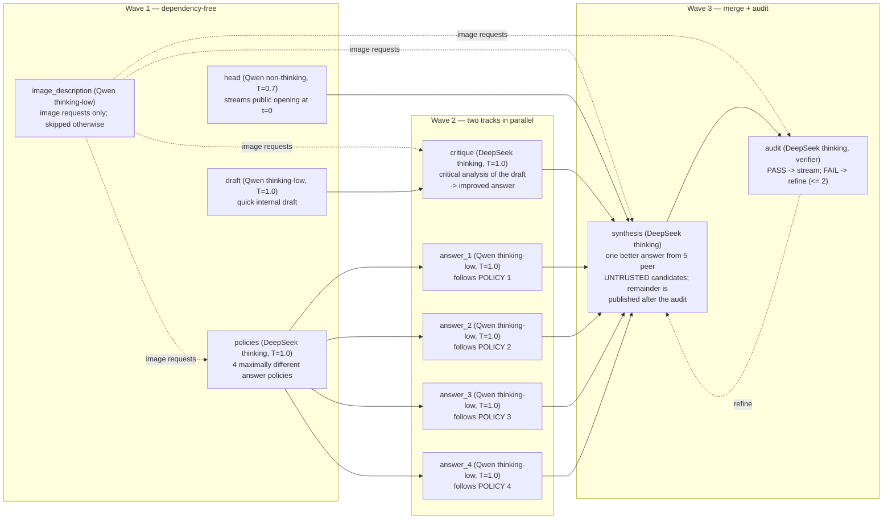

# Qwen3.8 + DeepSeek V4 dual-track policy ensemble on 8 x RTX PRO 6000

This example starts one layered quality-first product path with one command:

```text
Open WebUI
    -> Kairyu L3 product API (:8003; model kairyu-auto-max)
        -> Kairyu L2: ONE dual-track ensemble DAG for every request
           (11 roles: 10 generation + 1 audit verifier)
            Track A: DeepSeek writes 4 maximally different answer policies;
                     4 Qwen replicas answer in parallel, one policy each
            Track B: a Qwen quick draft, critically refined by thinking
                     DeepSeek — concurrently with Track A
            Merge:   thinking DeepSeek synthesizes one better answer from
                     the 5 peer candidates (refined answer + 4 policy
                     answers); a DeepSeek audit verifies it (PASS/FAIL,
                     <= 2 refinement rounds) before the remainder streams
            Images:  a Qwen image_description stage runs on image requests
                     only and feeds the text-only DeepSeek roles
        -> deployment-owned L1 pools: 4 x Qwen3.8-27B-FP8 TP1 (GPU 0-3),
           DeepSeek-V4-Flash-0731 TP4+EP4 (GPU 4-7)
    -> Kairyu L3 final answer

Embedding clients
    -> Kairyu L3 embeddings API (:8003; model embed-small)
        -> pinned offline FastEmbed MiniLM bundle (384 dimensions)
```

The head role commits the public answer opening within a small-prompt Qwen
TTFT (~0.3 s measured at c1), so the product's semantic TTFT (first public
`content` token) is gated at **<= 2x the DeepSeek L1 direct row at the same
concurrency** while both tracks run behind the committed opening
(DTO-D3, inherited from ECO-D4).

## The dual-track DAG (DTO-D1)

One served model, one profile, three waves. **Every request runs the complete
Conductor DAG: there is no route that hits a single L1 engine directly, no
profile selection, and no LLM profile judge.**



Role contracts:

| role | worker | what it does |
|---|---|---|
| `head` | Qwen TP1 | dependency-free; streams the committed public opening from t=0 (the TTFT gate) |
| `draft` | Qwen TP1 | quick complete internal draft — Track B's input, never published |
| `image_description` | Qwen TP1 | image requests only (`requires: image`; skipped entirely otherwise): precise textual description of the attached image for the text-only DeepSeek roles |
| `policies` | DeepSeek thinking | ONE call emitting POLICY 1..4, each a substantively different angle/method/priority set |
| `answer_1..4` | Qwen TP1 x4 | four policy-bound answers in parallel, one per replica; the policy list steers HOW, the request alone defines WHAT |
| `critique` | DeepSeek thinking | deliberates privately over the UNTRUSTED draft with critical thinking, then emits one improved complete answer |
| `synthesis` | DeepSeek thinking | the selected final unit: examines the five UNTRUSTED candidates (critique's refined answer + the four policy answers) as peers, verifies them, and writes one better answer; the remainder after the committed opening is published once the audit passes |
| `audit` | DeepSeek thinking | verifier on `synthesis`: judges opening + remainder as one public answer (correctness, completeness, consistency, reply format); first line `PASS`/`FAIL`; FAIL feedback drives up to 2 refinement rounds, after which the last attempt is published |

Design notes (see
[`docs/design/example-dual-track-orchestration.md`](../../docs/design/example-dual-track-orchestration.md)):

- The L2 DSL has no output-splitting mechanism, so each answerer receives the
  whole policy list and is bound to its own policy by prompt plus a distinct
  `seed_offset` (DTO-D2). The REQUEST and POLICY LIST blocks are
  byte-identical for deterministic policy binding, not for cross-replica
  cache reuse: the four answers run on independent replicas, and each
  replica prefills the newly generated policy list. With `shared_prefix`
  unset, placement follows session affinity and the queue-depth valve rather
  than `prefix_index`; only the leading REQUEST block may receive
  replica-local reuse from a preceding `head` or `draft` call.
- Every DeepSeek v4 flash role thinks (owner decision, DTO-D7): `policies`,
  `critique`, `synthesis`, and `audit` all end their scaffolds with
  `<｜Assistant｜><think>` and deliberate privately before their public text.
  The TTFT gate stays on the non-thinking Qwen head, and each role's token
  cap now bounds its `<think>` span plus its output together.
- Qwen sampling and thinking are fixed per role in `auto-max.yaml`, never
  derived from the caller's request: `draft`, `image_description`, and
  `answer_1..4` declare `reasoning_effort: low` (T=1.0), so they think at
  low effort — the shared
  Qwen template enables thinking for any explicit effort and clamps
  `high`/`max` to `low` — while `head` (T=0.7) declares no effort and stays
  non-thinking so the public opening streams immediately.
- The caller's L3 `reasoning_effort` reaches the DeepSeek roles: `policies`,
  `critique`, `synthesis`, and `audit` declare `reasoning_effort: inherit`,
  and a request without an explicit effort runs at the spec's
  `default_reasoning_effort: high`. The DeepSeek service's chat template
  (`deepseek-role-effort.jinja`) is a scaffold passthrough that splices the
  graded high/max reasoning preamble after `<｜begin▁of▁sentence｜>` into
  thinking-scaffold calls — all four DeepSeek roles — so `low` yields plain
  thinking and `high`/`max` strengthen every DeepSeek deliberation. The
  effort also grades the DeepSeek token budgets (DTO-D8, halved by
  DTO-D12): `policies`, `critique`, and `audit` declare
  `max_tokens_by_effort` `{low: 8192, high: 32768, max: 65536}` — half the
  vendor-recommended starting budgets, so the serial DeepSeek chain fits
  Terminal-Bench's 900 s per-turn agent envelope — bounding thinking +
  answer together, still clamped by `internal_max_tokens` (65536) and the
  request's public `max_tokens` — send a generous public `max_tokens` (the
  Chat UI default is 65536) or the higher tiers are clamped away.
- The audit verifier gates publication (DTO-D10): after every `synthesis`
  attempt the audit judges the committed opening plus the candidate
  remainder and answers `PASS` or `FAIL` on its first line; a FAIL verdict
  is fed back verbatim into a `synthesis` refinement (`max_refine_depth: 2`),
  and when the rounds are exhausted the last attempt is published. The
  remainder therefore reaches the stream only after the audit — the head
  still commits at t=0, so the TTFT gate is unaffected. Budget:
  `max_steps: 19` (10 generation units + 1 empty-final-output re-dispatch
  + 3 audit verdicts + 3 bounded inconclusive re-verifies + 2 refinements),
  `moa_samples: 0`.
- Per request the DeepSeek engine sees at most one in-flight call per wave
  (policies -> critique -> synthesis -> audit, plus refinement rounds); the
  four concurrent Qwen roles spread one-per-replica through
  `queue_depth_threshold: 0`.

On agent turns (declared tools, a plain-text structured-format demand, API
`response_format`, `n>1`, or `logprobs`) the head is disabled for the call
(issue #495): there is no committed opening, `synthesis` renders its
`prompt_headless` body, and the whole answer comes from the synthesized
final unit in exactly the demanded reply format, using a trailing tool
result directly when one is present (issue #496). Every internal role states
an intended tool call in one sentence instead of emitting tool-call syntax —
the publisher emits the actual call, and the audit judges the call itself.
`n>1` requests skip the audit (one verdict cannot judge independent
choices) and publish the synthesized choices unverified.

Qwen fits one 96 GB card, so four independent TP1 replicas provide more
aggregate memory bandwidth and lower queueing TTFT than spreading one dense
model over PCIe with TP4 — and the width-4 policy fan-out executes one
proposal per replica. Each Qwen replica retains the checkpoint's vision
encoder. Kairyu validates one inline PNG/JPEG/WebP image up to 8 MiB and
2,097,152 pixels, passes it to every image-capable Qwen role, and gives
the text-only DeepSeek roles the same role-tagged conversation with explicit
image placeholders plus, on image requests only, the Qwen
`image_description` stage's verbatim textual description (`requires: image`
skips the stage entirely — no call, no budget step — on text requests,
DTO-D11). DeepSeek is sharded TP4+EP4 for capacity and retains the
measured eight-GPU example's FP8 KV, DSpark-5, SM120 fallbacks, prefix caching,
chunked batching, and full/piecewise CUDA Graphs.

The Qwen replicas carry the single-GPU winner
(`max_num_batched_tokens=32768`, `max_num_seqs=32`, FP8 KV, FP16
Gated-DeltaNet state, piecewise CUDA Graphs) with speculative decoding disabled.
MTP-3 remains a measured candidate: it improved the role-shaped c1/c4/c8 rows,
but this public deployment admits c16/c32 matrices and the matching Qwen TP1
saturation rows regressed. Re-enable it only after the deployed high-concurrency
envelope passes without regression (see [MEASUREMENTS.md](MEASUREMENTS.md)).
Qwen runs on official vLLM v0.23.0. DeepSeek intentionally stays on the measured
`aa0d513027` SM120 build because v0.23.0 does not support this checkpoint's
DSpark path and its generic MTP loader cannot load the 0731 MTP weights.

Kairyu exposes one public chat model, `kairyu-auto-max`, and one public
embedding model, `embed-small`. A chat request enters L3 once, then L2 borrows
the deployment-owned L1 pools through `engine_ref`; L2 never calls the public
L3 endpoint recursively. The CPU sandbox execution service from the previous
coding DAG stays deployed (compose service, `kairyu.yaml` executor registry,
`sandbox/` sources) but is no longer referenced by any role — execution
grounding can be re-adopted by a future DAG without redeploying.

In the same assistant response, completed L2/L1 stages are sent as
model-attributed `reasoning_content` and rendered by pinned Open WebUI in a
separate expandable internal-work item. The synthesis role's L3 final
answer alone is sent in `content`, so opening the item reveals each role,
attempt, worker, engine, model, and audit verdict without mixing
intermediate work into the answer.

The composed L1 services still use pinned vLLM. This proves the L3/L2/L1 object
boundary and UI behavior, but does **not** close the native-Kairyu L1 production
gate; native full-checkpoint correctness, recovery, soak, and performance gates
remain open. See
[`docs/design/example-layered-orchestration.md`](../../docs/design/example-layered-orchestration.md).

## Start

```sh
./run.sh
```

The command validates the exact eight-card inventory and NUMA affinity, pulls
the pinned Qwen vLLM release, reuses or builds the pinned DeepSeek SM120 image,
verifies or downloads both exact model revisions, builds Kairyu with the
pinned offline MiniLM bundle, waits for all eight services, verifies
`/routing`, sends a two-input embedding smoke, and prints:

```text
OpenAI API: http://127.0.0.1:8003/v1
Chat UI:    http://<outward-facing-host>:3000 (no authentication)
Chat model:      kairyu-auto-max (the only Chat UI model)
Embedding model: embed-small
```

Open WebUI listens on all host interfaces, requires no login, calls only
Kairyu L3, and is explicitly limited to `kairyu-auto-max`. The public
`/v1/models` endpoint additionally returns `embed-small`; the L1 pools are not
public IDs or Chat UI choices. The launcher validates that exact public
inventory, the explicit eleven-role dual-track DAG (including the streamed
head, the single-profile policy, and the `{max_steps: 19, max_refine_depth: 2}`
budget), and two ordered finite 384-dimensional embedding vectors with
positive usage before printing the URL.

### Choosing the reasoning effort from the Chat UI

Requests default to `reasoning_effort: high` (`default_reasoning_effort` in
`auto-max.yaml`). To pick a different level per chat, open Open WebUI's Chat
Controls → Valves and choose **Reasoning Effort** from the dropdown
(`default`/`low`/`high`/`max`; `default` leaves the server default in
charge). The dropdown is a globally active Open WebUI filter
(`webui-reasoning-effort-filter.py`) that the launcher installs and
self-verifies on every `up`, and it owns the field: an explicit level
overrides any `reasoning_effort` set elsewhere — including the stock
v0.11.0 Advanced Params free-text input, which stays visible but never
reaches Kairyu — and `default` removes such values so the server default
applies. The selection is forwarded as the OpenAI-compatible
`reasoning_effort` body field.
The chosen level flows through the `inherit`-declared DeepSeek roles and
grades every DeepSeek deliberation (`policies`, `critique`, `synthesis`,
`audit`) as well as their thinking+answer token budgets
(`max_tokens_by_effort`, DTO-D8/D12); the
Qwen roles keep their fixed per-role declarations regardless of the UI
setting. The API equivalent:

```sh
curl -sS http://127.0.0.1:8003/v1/chat/completions \
  -H 'Content-Type: application/json' \
  --data '{"model":"kairyu-auto-max","reasoning_effort":"max","messages":[{"role":"user","content":"Prove it."}]}'
```

`/v1/responses` clients (Codex among them) set the same knob through
`reasoning.effort`; OpenAI-style levels are normalized onto Kairyu's —
`minimal`/`low`→`low`, `medium`/`high`→`high`, `xhigh`/`max`→`max` — so a
Codex `xhigh` profile reaches the max tier.

The embedding model is the truthfully named
`sentence-transformers/all-MiniLM-L6-v2` FastEmbed deployment, not an alias for
OpenAI's `text-embedding-3-large`. Probe it directly with:

```sh
curl -sS http://127.0.0.1:8003/v1/embeddings \
  -H 'Content-Type: application/json' \
  --data '{"model":"embed-small","input":["first","second"],"encoding_format":"float"}'
```

Selecting this model from tau2's pinned `banking_knowledge/alltools` consumer
is tracked separately in `ytworks/kairyu-bench#5`; this deployment does not
mislabel MiniLM to satisfy tau2's historical OpenAI model default.

All persistent state is bind-backed below `/mnt/nvme`:

- Qwen weights reuse `/mnt/nvme/kairyu/model-volumes/qwen3.8-27b-1gpu/models`.
- DeepSeek's external Docker volume is verified to bind
  `/mnt/nvme/kairyu/model-volumes/deepseek-v4-flash-0731-8gpu`.
- Four independent Qwen compilation caches, the DeepSeek compilation cache,
  and Open WebUI data live below
  `/mnt/nvme/kairyu/model-volumes/qwen3.8-deepseek-v4-8gpu/`.

`NVME_STORAGE_ROOT` may select a different root only when it is still under
`/mnt/nvme`; non-NVMe roots fail closed. `VERIFY_MODEL=1 ./run.sh` rehashes both
checkpoint trees. Lifecycle commands are `./run.sh up`, `./run.sh status`,
`./run.sh logs`, and `./run.sh down`.

## Serving verification

```sh
./verify.sh list
./verify.sh serving-auto-max
./verify.sh serving-auto-max-coding
```

`serving-auto-max` records the generic-workload product serving matrix and
proves the head/synthesis public stream plus the audit verdict end-to-end.
`serving-auto-max-coding`
runs a deterministic self-contained Python-task dataset at c1/8/16/32,
measures the paired DeepSeek-direct row on the same dataset through the
loopback L1 endpoint, and
**fails unless the product's semantic TTFT p50 stays within 2x the direct
row** (pinned `example.json` denominators are the fallback ceiling). The
last green run is the dated 2026-08-18 section of `MEASUREMENTS.md` (run
`20260818T025710Z`: TTFT gate PASS at every concurrency, binding c32 row
0.67×), measured on the previous DAG; the DTO-D10..D12 DAG (synthesis +
audit loop, image_description, halved DeepSeek budgets) is **not yet
GPU-measured** and every older section does not transfer. ChatUI continues
to call only Kairyu
L3. Raw artifacts go to the configured NVMe
`verification-results/<UTC-run-id>/` directory. Model and product evaluations
are invoked explicitly through `python -m evals`; coding accuracy versus
frontier APIs is owned by the external `kairyu-bench` repository.

## Reproducibility pins

- Qwen revision: `017b9c7af6b5689d5dd426a76e0bc077eb5ca20a`
- Qwen tree SHA-256: `9825ce119c9693172e04dd2a1f2437884503ceab9bf55606141e6662c9fe301e`
- DeepSeek revision: `9e165c30e2704aec5d9d593cce3eebd58bbef1cb`
- DeepSeek tree SHA-256: `90bd164d6f778d798eeaecd3517d83b87d49d300756a9217ada14a2b15203754`
- Qwen vLLM release/source: `v0.23.0` /
  `0fc695fc6d1d82e9a5ac6835ac8e4e1c83703665`
- Qwen vLLM image digest:
  `sha256:6d8429e38e3747723ca07ee1b17972e09bb9c51c4032b266f24fb1cc3b22ed8f`
- DeepSeek vLLM source: `jasl/vllm@aa0d51302747ea80f282e26949708b3253409fe2`
- DeepSeek vLLM image digest:
  `sha256:99756b54424a4697f69476b29aa02fb7f8112aaa74fa8203a7bf8a0bae4ca6f1`
- Open WebUI: `v0.11.0-slim` plus the digest in `example.json`

Set `KAIRYU_RESPONSES_COMPACTION_SECRET` to at least 32 random bytes before
`docker compose up` (e.g. `export KAIRYU_RESPONSES_COMPACTION_SECRET=$(openssl
rand -hex 32)`); Codex remote-compaction tokens on `/v1/responses` are sealed
with it, and a stable value keeps them valid across gateway restarts.
Override API/UI/tokenizer-oracle ports with `API_PORT`, `CHAT_UI_PORT`, and
`DEEPSEEK_L1_PORT`. Both L3 endpoints bind all host interfaces by default, so
the API and UI remain reachable through both `127.0.0.1` and the outward-facing
host address. The launcher discovers that address for its printed URLs; set
`PUBLIC_HOST` when clients must use a DNS name, public NAT address, or reverse
proxy. Kairyu's L3 API and the UI are intentionally unauthenticated, so restrict
ports 8003 and 3000 at the firewall or place appropriate TLS/access controls in
front of them when exposure beyond a trusted network is not intended. Set an
explicit bind address when either endpoint must be restricted. Override the
two L1 images independently with `QWEN_VLLM_IMAGE` and
`DEEPSEEK_VLLM_IMAGE`; non-default overrides must already exist locally.

See [MEASUREMENTS.md](MEASUREMENTS.md) for the historical runtime-selection
and serving-performance analysis.
