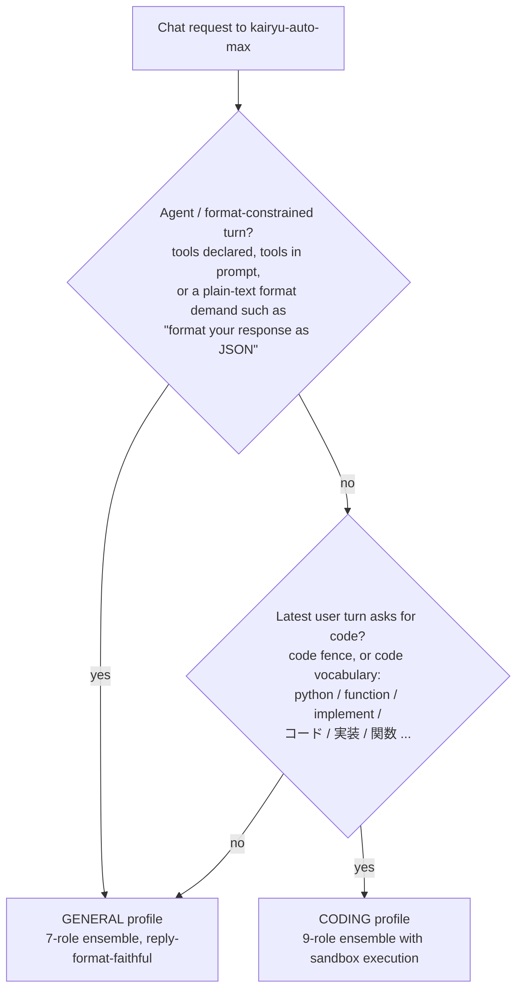
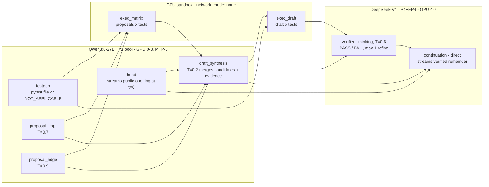
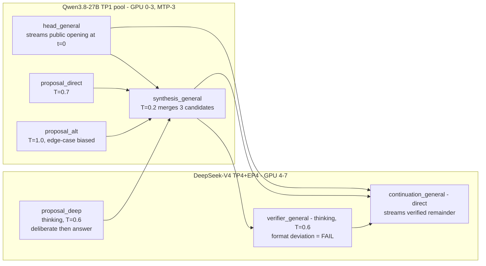

# Qwen3.8 + DeepSeek V4 tiered coding orchestration on 8 x RTX PRO 6000

This example starts one layered coding-first product path with one command:

```text
Open WebUI
    -> Kairyu L3 product API (:8003; model kairyu-auto-max)
        -> Kairyu L2: auto-selects ONE of two full ensemble DAGs per request
            [coding profile - 9 roles]          [general profile - 7 roles]
            head (Qwen) streams opening         head (Qwen) streams opening
            testgen + 2 proposals (Qwen)        2 Qwen proposals + 1 thinking
            sandbox runs generated pytest         DeepSeek deep proposal
            Qwen synthesis -> executor          Qwen synthesis (format-faithful)
            DeepSeek thinking verifier          DeepSeek thinking verifier
            continuation (DeepSeek direct)      continuation (DeepSeek direct)
        -> deployment-owned L1 pools: 4 x Qwen3.8-27B-FP8 TP1 (GPU 0-3),
           DeepSeek-V4-Flash-0731 TP4+EP4 (GPU 4-7), CPU sandbox executor
    -> Kairyu L3 final answer

Embedding clients
    -> Kairyu L3 embeddings API (:8003; model embed-small)
        -> pinned offline FastEmbed MiniLM bundle (384 dimensions)
```

The head role commits the public answer opening within a small-prompt Qwen
TTFT (~0.3 s measured at c1), so the product's semantic TTFT (first public
`content` token) is gated at **<= 2x the DeepSeek L1 direct row at the same
concurrency** while the
ensemble, sandbox execution, and verification run behind the committed
opening. The same TTFT gate applies to both profiles.

## Which requests take which DAG (automatic profile selection)

One served model, two full ensembles (ECO-D6, issue #509). The profile is
chosen per request by a deterministic rule — a pure function of the call, so
preflight and execution always agree — and **both outcomes are complete
Conductor DAGs: there is no route that hits a single L1 engine directly.**



Concrete examples:

| Request | Profile | Why |
|---|---|---|
| Terminus-2 agent turn: "…Format your response as JSON… run these shell commands" | general | plain-text structured-format demand |
| Codex CLI / IDE turn with declared `tools` | general | tools present |
| "Write a python function that reverses a list." | coding | code vocabulary in the latest user turn |
| "リストを逆順にする関数を実装して" | coding | code vocabulary (Japanese) |
| "What should I cook tonight with rice and eggs?" | general | no agent envelope, no code signal |

The chosen profile is observable: the result trace carries
`role profile: coding|general`, `/routing` reports both role lists, and the
launcher asserts both DAG shapes at readiness.

### Coding profile (9 roles — unchanged specialization)

Execution-grounded: proposals are run against a generated pytest file in the
network-less sandbox before synthesis is verified.



### General profile (7 roles — every model, no sandbox stages)

Reply-format-faithful: every role's contract is "answer in exactly the format
the conversation demands" (for example an agent loop's JSON envelope), and a
format deviation is a verifier FAIL. Execution grounding stays the coding
profile's specialization; the general profile instead adds a third,
reasoning-diverse proposal on thinking DeepSeek so all deployed models
contribute.



On agent turns (tools or a plain-text format demand) the head is disabled for
the call (issue #495) in either profile: there is no committed opening, the
publisher renders its `prompt_headless` body, and the whole answer comes from
the verified continuation — measured at ~15 s per turn on this hardware
against the previous 63.9 s median (issue #509).

Qwen fits one 96 GB card, so four independent TP1 replicas provide more
aggregate memory bandwidth and lower queueing TTFT than spreading one dense
model over PCIe with TP4. Each Qwen replica retains the checkpoint's vision
encoder. Kairyu validates one inline PNG/JPEG/WebP image up to 8 MiB and
2,097,152 pixels, passes it to every image-capable Qwen proposal role, and gives
the text-only DeepSeek roles the same role-tagged conversation with explicit
image placeholders. DeepSeek is sharded TP4+EP4 for capacity and retains the
measured eight-GPU example's FP8 KV, DSpark-5, SM120 fallbacks, prefix caching,
chunked batching, and full/piecewise CUDA Graphs.

The Qwen replicas carry the single-GPU winner
(`max_num_batched_tokens=32768`, `max_num_seqs=32`, FP8 KV, FP16
Gated-DeltaNet state, piecewise CUDA Graphs) plus one measured deviation:
MTP-3 speculative decoding, adopted for this deployment's role-shaped load
(c1 +43.9%, c4/c8 aggregate +26%, lossless — see
[MEASUREMENTS.md](MEASUREMENTS.md)); the 1-GPU general-API example stays
no-MTP because its c16/c32 criterion regressed there. Qwen runs on official
vLLM v0.23.0. The pool metadata marks MTP active so Kairyu rejects non-zero
`min_p` during request validation, rather than surfacing vLLM's
speculative-decoding failure after dispatch. DeepSeek intentionally stays on the measured
`aa0d513027` SM120 build because v0.23.0 does not support this checkpoint's
DSpark path and its generic MTP loader cannot load the 0731 MTP weights.

Kairyu exposes one public chat model, `kairyu-auto-max`, and one public
embedding model, `embed-small`. A coding-profile chat request enters L3 once,
then L2 borrows
the deployment-owned L1 pools through `engine_ref` and the sandbox execution
service through `executor_ref`: the Qwen head streams the committed public
opening immediately while a Qwen test generator and two temperature/seed
diversified Qwen proposals run in parallel; the sandbox runs each proposal
against the generated pytest file (with a per-test consensus signal); Qwen
synthesizes a private draft from the committed opening, both candidates, and
the execution matrix; the draft is re-executed and verified by the thinking
DeepSeek verifier before the DeepSeek continuation streams the remainder
after the committed opening. A failed
verifier repeats synthesis, execution, and verification at most twice
(`moa_samples: 0`, `max_refine_depth: 1`, `max_steps: 12`); L2 never calls the
public L3 endpoint recursively.

The executor is a CPU-only container with `network_mode: none` — it has no IP
interface at all, so hostile code has no callback path to the gateway or
anywhere else. Kairyu reaches its HTTP protocol only through a shared Unix
domain socket volume (mounted read-only on the Kairyu side). The container
also has a read-only rootfs, noexec tmpfs, non-root user, no capabilities,
and pids/memory limits, and runs model-generated code as hostile input under
per-submission rlimits with a wall-clock process-group killer. Executor
results enter role prompts as untrusted machine JSON, and a sandbox outage
degrades executor stages to an `unavailable` report instead of failing
requests.

In the same assistant response, completed L2/L1 stages are sent as
model-attributed `reasoning_content` and rendered by pinned Open WebUI in a
separate expandable internal-work item. The publisher's L3 final answer alone
is sent in `content`, so opening the item reveals each role, attempt, worker,
engine, and model without mixing intermediate work into the answer.

The composed L1 services still use pinned vLLM. This proves the L3/L2/L1 object
boundary and UI behavior, but does **not** close the native-Kairyu L1 production
gate; native full-checkpoint correctness, recovery, soak, and performance gates
remain open. See
[`docs/design/example-layered-orchestration.md`](../../docs/design/example-layered-orchestration.md).

## Start

```sh
./run.sh
```

The command validates the exact eight-card inventory and NUMA affinity, pulls
the pinned Qwen vLLM release, reuses or builds the pinned DeepSeek SM120 image,
verifies or downloads both exact model revisions, builds Kairyu with the
pinned offline MiniLM bundle, waits for all eight services, verifies
`/routing`, sends a two-input embedding smoke, and prints:

```text
OpenAI API: http://127.0.0.1:8003/v1
Chat UI:    http://<outward-facing-host>:3000 (no authentication)
Chat model:      kairyu-auto-max (the only Chat UI model)
Embedding model: embed-small
```

Open WebUI listens on all host interfaces, requires no login, calls only
Kairyu L3, and is explicitly limited to `kairyu-auto-max`. The public
`/v1/models` endpoint additionally returns `embed-small`; the L1 pools are not
public IDs or Chat UI choices. The launcher validates that exact public
inventory, the explicit nine-role coding DAG (including the streamed head and
the sandbox executor binding), the seven-role general ensemble profile, and
two ordered finite 384-dimensional embedding vectors with positive usage
before printing the URL.

The embedding model is the truthfully named
`sentence-transformers/all-MiniLM-L6-v2` FastEmbed deployment, not an alias for
OpenAI's `text-embedding-3-large`. Probe it directly with:

```sh
curl -sS http://127.0.0.1:8003/v1/embeddings \
  -H 'Content-Type: application/json' \
  --data '{"model":"embed-small","input":["first","second"],"encoding_format":"float"}'
```

Selecting this model from tau2's pinned `banking_knowledge/alltools` consumer
is tracked separately in `ytworks/kairyu-bench#5`; this deployment does not
mislabel MiniLM to satisfy tau2's historical OpenAI model default.

All persistent state is bind-backed below `/mnt/nvme`:

- Qwen weights reuse `/mnt/nvme/kairyu/model-volumes/qwen3.8-27b-1gpu/models`.
- DeepSeek's external Docker volume is verified to bind
  `/mnt/nvme/kairyu/model-volumes/deepseek-v4-flash-0731-8gpu`.
- Four independent Qwen compilation caches, the DeepSeek compilation cache,
  and Open WebUI data live below
  `/mnt/nvme/kairyu/model-volumes/qwen3.8-deepseek-v4-8gpu/`.

`NVME_STORAGE_ROOT` may select a different root only when it is still under
`/mnt/nvme`; non-NVMe roots fail closed. `VERIFY_MODEL=1 ./run.sh` rehashes both
checkpoint trees. Lifecycle commands are `./run.sh up`, `./run.sh status`,
`./run.sh logs`, and `./run.sh down`.

## Serving verification

```sh
./verify.sh list
./verify.sh serving-auto-max
./verify.sh serving-auto-max-coding
```

`serving-auto-max` records the generic-workload product serving matrix and
proves the executor skip path end-to-end. `serving-auto-max-coding` runs a
deterministic self-contained Python-task dataset at c1/8/16/32, requires real
(non-skipped) sandbox execution in at least 90% of each row's traces,
measures the paired DeepSeek-direct row on the same dataset through the
loopback L1 endpoint, and
**fails unless the product's semantic TTFT p50 stays within 2x the direct
row** (pinned `example.json` denominators are the fallback ceiling). All
historical performance rows in `MEASUREMENTS.md` predate the coding DAG and do
not transfer without a fresh run. ChatUI continues to call only Kairyu L3. Raw
artifacts go to the configured NVMe `verification-results/<UTC-run-id>/`
directory. Model and product evaluations are invoked explicitly through
`python -m evals`; coding accuracy versus frontier APIs is owned by the
external `kairyu-bench` repository.

## Reproducibility pins

- Qwen revision: `017b9c7af6b5689d5dd426a76e0bc077eb5ca20a`
- Qwen tree SHA-256: `9825ce119c9693172e04dd2a1f2437884503ceab9bf55606141e6662c9fe301e`
- DeepSeek revision: `9e165c30e2704aec5d9d593cce3eebd58bbef1cb`
- DeepSeek tree SHA-256: `90bd164d6f778d798eeaecd3517d83b87d49d300756a9217ada14a2b15203754`
- Qwen vLLM release/source: `v0.23.0` /
  `0fc695fc6d1d82e9a5ac6835ac8e4e1c83703665`
- Qwen vLLM image digest:
  `sha256:6d8429e38e3747723ca07ee1b17972e09bb9c51c4032b266f24fb1cc3b22ed8f`
- DeepSeek vLLM source: `jasl/vllm@aa0d51302747ea80f282e26949708b3253409fe2`
- DeepSeek vLLM image digest:
  `sha256:99756b54424a4697f69476b29aa02fb7f8112aaa74fa8203a7bf8a0bae4ca6f1`
- Open WebUI: `v0.11.0-slim` plus the digest in `example.json`

Override API/UI/tokenizer-oracle ports with `API_PORT`, `CHAT_UI_PORT`, and
`DEEPSEEK_L1_PORT`. Both L3 endpoints bind all host interfaces by default, so
the API and UI remain reachable through both `127.0.0.1` and the outward-facing
host address. The launcher discovers that address for its printed URLs; set
`PUBLIC_HOST` when clients must use a DNS name, public NAT address, or reverse
proxy. Kairyu's L3 API and the UI are intentionally unauthenticated, so restrict
ports 8003 and 3000 at the firewall or place appropriate TLS/access controls in
front of them when exposure beyond a trusted network is not intended. Set an
explicit bind address when either endpoint must be restricted. Override the
two L1 images independently with `QWEN_VLLM_IMAGE` and
`DEEPSEEK_VLLM_IMAGE`; non-default overrides must already exist locally.

See [MEASUREMENTS.md](MEASUREMENTS.md) for the historical runtime-selection
and serving-performance analysis.
