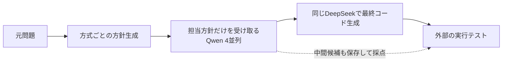

# 共同解法方針設計の研究計画 v1

作成日: 2026-09-10。状態: **研究計画・入力設定の作成済み。研究driverと採点adapterは未実装、モデル実験は未実施。**

この文書が研究計画の全体版。実装作業は [実装・実行計画](../../docs/superpowers/plans/2026-09-10-joint-planning-study.md) に定義する。設定は [protocol.json](protocol.json)、ソース固定情報は [sources.lock.json](sources.lock.json)、プロンプトは [prompts/](prompts/) を参照する。

## 1. 研究の目的と一つの問い

**問い:** 同じモデル構成・四つの提出候補という条件で、解法方針を共同設計する方式は、独立に設計する方式より最終プログラムの正答率を高めるか。

対象は Kairyu example の `policies → answer_1..4 → synthesis` に着想を得た推論方式。共同計画には解法の重複を避ける可能性がある一方、同じ不適切な方向へ候補を誘導する可能性がある。どちらが起きると仮定せず、最終回答と中間候補を外部テストで測る。

研究の貢献候補は、共同設計という具体的な手順の効果を、候補生成と最終回答の両段階で示すこと。新モデル・新GPU・システム全体の優越・形式的正しさの保証は対象にしない。モデル内部の意味的多様性や「同じ誤解」を、人手評価なしの成績だけから断定しない。

[森畑「研究とは何か」](https://www.graco.c.u-tokyo.ac.jp/labs/morihata/research_memo.htm)に沿って、問い、既知の範囲、比較、結果から言えることを対応させ、再現可能な結果と記述を公開する。新規性は下記の限定した差について継続確認する。

## 2. 固定する条件と評価から除外する項目

- ハードウェアは既存の **8×RTX PRO 6000 Blackwell 96GB、現在のPCIe構成**に固定。機械の追加・交換、クラウド計算資源、NVLink機との比較をしない。
- 新しい学習・fine-tuning・モデルサイズ探索をしない。既存Qwen/DeepSeekのcheckpoint、量子化、配置を固定する。
- 新規の人手採点、方針の意味分類、人手による失敗原因ラベルを作らない。最終採点のLLM judgeも使わない。
- **計算費用、金額換算、GPU時間・token当たりの正答率、費用対効果、効率ランキングを研究評価から除外する。** トークン上限は停止条件・実験条件としてのみ使用する。時刻は日程・障害調査、usageは打ち切り・設定確認にのみ用いる。
- AUTOルーティング、先行公開するhead、別系統のcritique、requirements、audit、自己修正は主実験に含めない。全方式が見る元問題は同一。

## 3. 先行研究との関係

| 研究 | 既知の内容と、この計画での扱い |
|---|---|
| [PlanSearch](https://arxiv.org/abs/2409.03733) | 自然言語の観察・方針による探索の多様化。複数の観察を一度に作ることも既知。共同4完成方針と独立4完成方針の手順比較に絞る。Dに明示的な枝刈り適用版を置く。 |
| [Self-MoA](https://arxiv.org/abs/2502.00674) | 候補の平均品質と多様性が統合結果に影響する。平均候補正答率を併記し、全滅率だけを「相関」の証拠にしない。 |
| [候補なし対照による統合分析](https://arxiv.org/abs/2608.18379) | 候補を読む効果と、追加で問題を解く効果を分ける必要がある。Eを置く。 |
| [Trace-Level Synthesis](https://arxiv.org/abs/2605.29116) | 補完性や統合による改善・悪化自体は既に議論されている。その現象の初発見とは主張しない。 |

原論文の異なるモデル・多数候補での数値を、そのまま本研究の数値と順位比較しない。比較対象を同じ問題・モデル設定で再実行する。Dは原論文の完全再現ではない。

## 4. モデル構成と実行する処理

| 役割 | checkpointと配置 | wire |
|---|---|---|
| planner / synthesizer | DeepSeek-V4-Flash-0731、mixed FP4/FP8、TP4/EP4、既存GPU 4–7 | `http://deepseek:8000/v1/chat/completions` |
| solver 0–3 | Qwen3.8-27B FP8、同一checkpointのTP1×4、既存GPU 0–3 | `http://qwen-0:8000/v1/chat/completions`〜`qwen-3` |

revision、期待するimage digest、samplingは `protocol.json` に記載。これらのモデルは研究装置であり、モデル間の能力比較を目的としない。

参照するexampleの版は [Kairyu commit `31f1adc1`](https://github.com/ytworks/kairyu/tree/31f1adc1caaacb7b8689a811aa65ea7ff4b74ffb/examples/qwen3.8-deepseek-v4-8gpu) に固定する。`sources.lock.json` の `local_source_sha256` はこのcommitのファイルを指し、現在のmainの内容や稼働workerの同一性を意味しない。研究実装時にはこの版からソースを取得してhashを検証し、稼働状態は別途確認する。



現在のDSLは出力文字列のJSON要素参照を扱わないため、**既存workerを利用する研究専用HTTP driver**を実装する。これはKairyu exampleから切り出した方式の実験であり、現行Conductorの全DAGの測定ではない。driverはGPUを要求しない一時containerとして既存Compose networkへ参加させる。network名は実containerのnetwork情報から取得する。public `:8003` の `kairyu-auto-max`へ内部model名を送って代用しない。

DeepSeek workerの `deepseek-role-effort.jinja` は最初のmessageのcontentを使う。したがってsystem/userを分けず、**単一user message**のcontentに既存形式の完全なscaffoldを入れる。

```text
<｜begin▁of▁sentence｜><｜User｜>{rendered_role_prompt}<｜Assistant｜><think>
```

Qwenは単一user messageに通常のrole promptを入れる。両者とも回答は `message.content`、thinkingは `reasoning_content`として別保存する。thinkingを方針や候補コードへ混ぜない。全armで `/chat/completions` を使い、`/completions` と混在させない。既存requirements専用のthinking budget hookやaudit regexが新プロンプトへ適用されるとは仮定しない。

## 5. 比較条件

| arm | 生成手順 | 成功経路のprovider呼び出し数 |
|---|---|---:|
| A_sampling | 方針なしのQwen 4候補 → 共通統合 | 5 |
| **B_independent** | 互いの出力を見ないDeepSeek 4計画 → Qwen 4候補 → 共通統合 | 9 |
| **C_joint** | DeepSeek 1回で共同4計画 → Qwen 4候補 → 共通統合 | 6 |
| D_plansearch_pruned4 | 次節の観察・方針探索 → 4コード → 共通統合 | 23–27 |
| E_direct | 元問題だけからDeepSeekが最終コードを生成 | 1 |

主比較は **C−Bの最終正答率差**。A/D/Eは参照条件であり、主仮説の検定を増やさない。Bの4計画は同じDeepSeek endpointへ**並行投入**し、すべて終わってからsolverを開始する。Cでも共同計画完了後に4 solverを並行投入する。外側のworkflowは1つずつ実行する。

Cは「4方針を同時に作り、相互の重複を避けるよう指示する」手順全体を介入とする。1回対4回の生成、共有されるthinking、重複回避の指示を個別に分離する実験ではない。したがって差が出ても、注意機構や独立性だけを原因として断定しない。

B/Cでsolverへ渡す情報は「元問題＋担当方針1つ」。計画のthinking、他の方針、方法名、正解情報を渡さない。統合器へは元問題と4コードだけを渡し、計画・出所arm・テスト結果を渡さない。Eは同じ `final.md` の候補配列を `[]` として実行し、統合と同一のsampling・出力上限にする。

### D: PlanSearch-pruned-4 の確定した適用仕様

公式commitは `sources.lock.json` に固定。公式 `num_completions=4` は全候補生成後に4つ返す設定であり、4コードのみを生成する制御ではない。

1. 原問題から観察を10個要求する。公式の生成→列挙→有用な観察抽出→Python list形式化を使う。list形式化のみ公式に合わせ最大3試行。各観察ノードは4–6回のDeepSeek呼び出し。
2. 第1層の観察のサイズ0–2部分集合を列挙し、下記hash順の1集合だけを第2層へ展開。同じ観察処理をもう一度実行する。
3. 探索済みの階層から公式 `collect_all_problem_obs()`相当で得た観察集合を重複除去し、**方針・コード生成前に**hash順で2集合を選ぶ。
4. 各集合でDeepSeekが原方針→批判→修正方針を生成。原方針と修正方針の両方を残し、計4方針とする。修正応答の追加整形呼び出しは入れない。
5. 各方針をQwenの擬似コード生成→コード生成へ渡す。4コードを共通の統合器へ渡す。

選択hashはUTF-8のcanonical JSON `[study_id, uid, replicate_seed, stage, observation_tuple]`のSHA256。JSONは `ensure_ascii=False, separators=(',', ':')`。同点時は観察tupleの辞書順。テスト結果による選択は行わない。観察集合が不足した場合、同じ集合を複製しない。不足するコードslotは、共通の「方針なしsolver」へfallbackする。

移植対象は `search/combo_observation_model.py`、同名のprompts、`idea_prompts.py`、`pseudocode_prompts.py`とそこから参照されるfew-shot。完全な依存リポジトリの古いvLLMを既存workerへ導入しない。観察listは `ast.literal_eval()` と `list[str]`検査で解析し、公式のPython `eval()`を使わない。プロンプト・few-shotの出典とハッシュを実行manifestへ記録する。

これは**4つのコード候補に探索幅を制限した適用版**であり、共同計画の純粋な因果対照ではない。Dには追加の推論段階があることを明示する。呼び出し数は処理の定義・完全性確認のために記録し、費用・効率の成績にはしない。

## 6. データと採点

### LiveCodeBench 主実験

- 公式 `livecodebench/code_generation_lite`、revision `0fe84c3912ea0c4d4a78037083943e8f0c4dd505`、`release_v6`。
- `test.jsonl`〜`test6.jsonl`の6ファイル。合計 **4,485,994,821 bytes**。LFS SHA256を `sources.lock.json` に保存済み。本計画作成時点ではpayload全体は未取得。
- 取得時に全ファイルのSHA256を確認し、1,055問と重複のない `platform:question_id` を確認。予期しない件数なら、別版へ切り替えず準備を停止する。
- `sha256('kairyu-joint-planning-v1:split:' + uid)`とuidの順で並べ、先頭50問をdev、続く400問をtest、残り605問を未使用とする。ID一覧と問題本文hashを生成前に固定する。
- 400問部分集合の結果と明示する。プラットフォーム・難易度の内訳は報告するが、成績を見て重みや選択を変更しない。
- generatorへの入力は `question_content` と、存在する場合の `starter_code` のみ。元の問題文中の公開例はそのまま残す。構造化されたテスト、metadata、difficulty、ID、正解コードは送信しない。

公式scorerはcommit `28fef95ea8c9f7a547c8329f2cd3d32b92c1fa24`。JSONデータを直接読むことでdataset scriptを自動実行せず、`CodeGenerationProblem.get_evaluation_sample()`と同じ公開＋private tests / `fn_name`を評価専用側で構成する。圧縮private testの復号も評価専用側で行う。

実行は公式 `lcb_runner.evaluation.testing_util.run_test` と同じ判定を使用。Python 3.11.13、1 testのtimeoutは公式既定の6秒、問題単位の外側timeoutは `(6+1) * test_count + 5` 秒。2問題を並列採点する。結果配列は `all(value > 0 for value in results)` かつ非空の場合だけ成功。`bool(-1)`や空配列の`all()`を成功にしてはいけない。単体のtest失敗・例外・timeoutは不正解。

### HumanEval+ 確認実験

- `HumanEvalPlus.jsonl.gz v0.1.10` の164問全件。Mini/NoExtreme版は使わない。
- 本計画作成時に配布物を取得して件数とSHA256を確認済み。archive: `272720b90ac375502c8ed23cd791c2a93dfb22a911641a494da74a426c09f101`。
- B/Cの両方式を各2 seedで実行。promptを元問題として送り、必要な関数signatureを保持した完全なmoduleを生成する。canonical solution、contract、base/plus test inputsは評価側だけに置く。
- EvalPlusへの提出は `{"task_id": "HumanEval/0", "solution": "完全な生成コード"}` の形式とする。`completion`に完全moduleを入れるとpromptが再び前置されるため使用しない。
- EvalPlus commit `26d6d00bb1fd0fa37f39c99d5290da67891d1c5e`の公式評価を使い、baseとplusの両方に成功した場合のみ正解。参照実行時間に基づくtimeout設定を全方式共通で固定し、`min_time_limit=0.2, gt_time_limit_factor=4.0`とする。このcommitの`check_correctness()`が両引数を受け取ることをソースで確認済み。参照時間は同じ採点containerで事前計測・保存し、全armで共用する。
- 主実験と混ぜて平均・検定を作らない。学習時未見とは保証しない。

### 採点の独立性と環境

driver containerには、allowlistだけで構成した `inputs.jsonl` をmountする。goldを含む原データ・採点結果はmountしない。コードの生成中にテストを実行したり、テスト成績を統合器に返したりしない。

採点は同じ既存機械のCPU上の専用containerで行う。ネットワークなし、GPUなし、非root、read-only root、16 GiB memory、2 CPU、512 pids、書込用tmpfsと結果出力先だけを用意する。実行環境のimage digestと依存lockを固定する。参照コードまで資源不足になる場合はdev段階で準備条件を見直し、test開始後に方式別の制限を変更しない。

## 7. 生成設定・失敗・順序の規則

- Qwen: `reasoning_effort=high`（既存templateのmedium相当）、T=1.0、top_p=.95、top_k=20。
- DeepSeek: 全段階で `reasoning_effort=high`。計画T=1.0、統合/EはT=.6。top_p=.95、top_k=-1。
- 1 provider requestのn=1、stream=false。固定seedは20260910/20260911。役割ごとの上限はthinkingと回答の合計。

| 上限level | Bの各計画 | Cの共同計画 | 各コード候補 | 統合/E | Dの各中間呼出し |
|---|---:|---:|---:|---:|---:|
| 0 | 2,048 | 8,192 | 8,192 | 16,384 | 4,096 |
| 1 | 4,096 | 16,384 | 16,384 | 32,768 | 8,192 |
| 2 | 8,192 | 32,768 | 32,768 | 65,536 | 16,384 |

dev最初の10問×全5方式×2 seedからlevel 0を開始する。あるarm/段階で長さ終了、空回答、計画構文不正のいずれかの割合が5%を超える場合だけ、全方式を同じ次levelへ移す。これは合算したtechnical-failure rateとし、方式の正答率差で選ばない。最初に条件を満たすlevelを採用し、残りdev40問を実行する。残り40問の確認でも5%を超える、またはlevel 2でも解消しない場合、本試験へ進めずparser/wire/上限設計の修正を研究計画へ反映する。修正前後を混ぜない。

計画は回答部分全体を `json.loads()`し、Bは長さ1、Cは長さ4の非空string配列を要求する。構文または長さが不正なら、その呼び出しに依存する計画slotを全て未使用とする。Bでは該当1slot、Cでは4slot。各slotは元問題のみでsolverを実行し、fallbackを記録する。自動で良い方針が出るまで引き直さない。Dのlist形式化最大3試行だけは、事前定義したアルゴリズム内部の処理として別記録する。

コードは最初の完全なMarkdown code fence内をstripして抽出する。フェンスなしは空コード。不完全な最終出力でも完全なcode fenceが得られれば通常通り採点し、`finish_reason=length`だけで自動的に不正解にはしない。コードの構文修復・人手修正を加えない。

各provider seedはcanonical JSON `[study_id, dataset, uid, replicate_seed, role, index]`のSHA256先頭8桁を整数化して `& 0x7fffffff`。同じsolver/final役割のseedはarm間で揃える。Dの追加役割には固有role名とnode indexを付ける。Bの計画indexは0–3、Cはindex=0。同じseedでも異なるpromptの出力が同一になるという前提は置かない。

task×replicateを1blockとし、そのblock内のarm順は専用seedでshuffleする。solver slotのworker割当はtask hash＋replicate番号で循環させ、同じblockではarm間で揃える。統合器へ渡す4候補の順序も専用seedでshuffleし、arm間で揃える。候補にarm名や「正解」ラベルを付けない。

通信障害はモデルの失敗と区別する。接続timeout 10秒、read timeout 1,800秒。接続失敗またはHTTP 429/502/503/504は同じpayloadとseedで30秒後に最大1回再送する。read timeoutや途中切断など実行中か不明な場合は、workerが静止した証拠が得られるまで再送・次block開始を止める。解消しない障害は未解決として残す。原リクエストと再送を両方保存する。

## 8. 指標と統計

問題i、方式a、seed sで最終コードが全テストに通れば `Y[i,a,s]=1`、それ以外は0。主推定量は

```text
d[i] = ((Y[i,C,seed1] - Y[i,B,seed1])
      + (Y[i,C,seed2] - Y[i,B,seed2])) / 2
delta = mean(d[i] for the 400 test problems)
```

百分率ポイントで報告する。400問題を単位に、全armと両seedを一緒に再標本化する対応ありcluster bootstrapを10,000回実行。seed=20260912、percentile 2.5/97.5を95%区間にする。800独立標本や個々のtest caseとして扱わない。

副指標は、候補単体の平均正答率、4候補中に正解がある割合、正解候補数0–4の分布、正解候補ありでの最終失敗率(discard)、正解候補なしでの最終成功率(rescue)、構文不正・fallback・打ち切り率。分子・分母を必ず示し、条件該当数0ならNAとする。

`any_correct`はIIDを仮定した標準pass@4とも、統合の性能上限とも呼ばない。B/Cで条件付きdiscardの母集団は変わるため、その差だけから統合器の因果的改善とは言わない。全候補不正解からのrescueも、候補の情報を組み合わせた証明にはならない。Eのfresh solveとの成績を併記する。

5ポイントを実用上意味のある差の目安として事前指定する。有意差と別概念。400問題で80%検出力を持つ差の近似は `2.8 * SD(d) / sqrt(400)`。単一の対応二値観測で不一致確率.10なら約4.4ポイント、.20なら約6.3ポイントとなるが、実際の2 seedの相関に依存する。devから見積もりと不確実性を報告し、400問で小差を検出できると保証しない。testを見て標本数・seed・主指標を変更しない。

全割当workflowを分母とし、未解決通信障害も0としたoperational scoreを主結果に含める。補助的に、未解決障害を含む問題cluster全体を除いた結果を明示して出す。未解決障害が予定workflowの1%を超える場合、確認的結論は出さず実行状態を修復する。モデルの不正解はこの停止条件に含めない。

## 9. 再現性と成果物

本試験前の `freeze.json` に、データID/本文hash、ソースhash、全prompt/few-shot、cap level、sampling、seedと順序、fallback、採点器、環境image/依存lock、解析コードを含める。異なるfreezeの結果を同じ試験へ混ぜない。

稼働状態は設定ファイルのhashだけで証明しない。開始/終了時と再開時に5 workerのcontainer ID、StartedAt、image ID、argv、GPU UUID/割当、モデルrevision/読込mount、実際のtemplate hashと読込時点、vLLM versionを記録する。環境変数全体・秘密情報は収集しない。稼働中のmodel/templateが固定設定と一致しない場合は開始しない。既存workerの再起動・モデル再配置は本計画作成作業には含めない。

保存する単位:

- `manifest.json` / `inputs.jsonl`: 問題一覧とgoldを除いた生成入力。
- `freeze.json` / `attestation.json`: 実行条件と稼働同一性。
- `calls.jsonl`: request intent、payload hash、raw response、finish reason、seed、試行番号、technical failure。時刻・usageは運用情報のみ。
- `plans.jsonl` / `candidates.jsonl` / `finals.jsonl`: 完全な回答部分と識別子。長さを省略しない。
- `grades.jsonl`: 候補・最終回答の外部採点。生成から参照できない場所に保存。
- `summary.json` / `report.md`: 主比較、確認実験、副指標、分母、信頼区間。

図表は(1)方式別最終正答率とC−B区間、(2)正解候補数0–4の分布、(3)候補正解の有無×最終正誤の遷移表。費用・効率・速度ランキングの図は作らない。

## 10. 作業順序、実行規模、完了条件

| 段階 | 実施内容 | 完了条件 |
|---|---|---|
| 準備 | pinnedデータ取得、ID固定、prompt/wire/driver/採点adapterを実装 | CPU契約検査、既知の正解/不正解による採点器確認、gold非流入、再開同一性が成立 |
| dev | 最初10問でcap選択、残り40問で動作と日程を確認 | 技術的失敗率の規則を満たし、未解決障害≤1%、全traceが揃う |
| freeze | 全条件と稼働設定を固定 | 内容をhashで識別し、以後の変更を拒否できる |
| 主実験 | LCB400問×5方式×2 seed | 4,000 workflowの完全な割当・出力・失敗記録 |
| 確認 | HumanEval+164問×B/C×2 seed | 656 workflowの記録 |
| 解析・論文化 | 固定解析から全体図表を生成、既知の範囲との差を論じる | 主比較と主張が一致し、データ・コード・手順を公開可能な形で整理 |

本評価は **4,656 workflow**。devは1 cap levelなら500、最大3 levelの初期較正を含めて最大700 workflow。再送は別記録。実行日数はdevで測った1 workflow当たりの経過時間から算出する。外側並列度は1なので、方式別の残件数×その方式のdev平均時間を合計して日程を出す。これは実行可能性の見積もりであり、研究の成績ではない。

工数の初期見積もりは、driver/採点adapter/固定化の実装2–4作業日、CPUとdevの不具合対応1–2作業日、集計・図表・論文の実験節1–2作業日。既存基盤を使う前提の見積もりで保証ではない。人手採点の工程は0。GPUでの無人実行日数と執筆全体は別に見積もる。

現在の完了範囲は研究計画、プロンプト、機械可読設定、公開ソースpin、HumanEval+の件数/hash確認まで。LCB全データ取得、driver/採点adapter実装、実行環境のfreeze、GPU試行、研究結果は未実施。

## 11. 結果から許される主張

- Cの最終正答率がBより改善: 固定したモデル・課題・計画上限の下で、共同設計方式が有効という証拠。
- 候補集合のみ改善: 探索で得られた利益が、現在の統合処理の最終成績へ十分反映されていないという証拠。
- Bが優れる: この条件で独立設計を選ぶ根拠。成績だけから共通の誤解や意味的多様性の原因までは特定しない。
- 区間が広い: 未確定。差がないこと・同等性・研究としての新規性が自動的に成立したとはしない。

どの結果でも、費用優位、他GPUへの一般化、他モデル構成への一般化、一般的なプログラム検証保証は結論に含めない。
